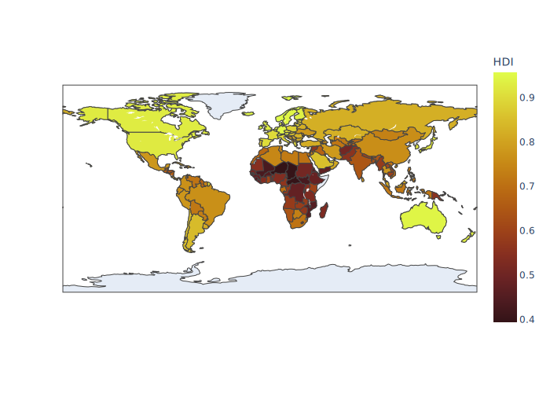

# Internet adoption around the world
This project is based on a study about the Internet adoption around the world and how the price, speed and country's development affects this data.

## Importing the libraries
The first thing to do is importing the modules and making sure that they are installed correctly into our envirorment.


```python
# Uncomment the lines below if the following modules are not installed on your envirorment
#!pip install matplotlib
#!pip install pandas
#!pip install plotly
#!pip install seaborn
#!pip install kaleido

import os
import pandas as pd
import matplotlib.pyplot as plt
import seaborn as sns
import plotly.express as px
```

## Project structure


The `datasets/` folder contains the following files.


```python
os.listdir("datasets")
```


    ['GDP2021.csv',
     'HDR2020.csv',
     'worldwide internet prices in 2022 - IN 2022.csv',
     'worldwide internet speed in 2022 - avg speed.csv',
     'worldwide internet users - users.csv']


Datasets used for this projects:
- `worldwide internet prices in 2022 - IN 2022.csv`: Contains informations about the price, plans available, and the price of most expensive and cheapest 1 GB for every country
- `worldwide internet speed in 2022 - avg speed.csv`: Contains the average speed in Mbit per second for every country
- `worldwide internet users - users.csv`: Contains the number of internet users and the total population for every country
- `GDP2021.csv`: Contains the GDP (Gross Domestic Product) per capita for every country. This index measures a country's economic output per person and is calculated by dividing the GDP of a country by its population.
- `HDR2020.csv`: Contains the HDI (Human Development Index) for every country. This index is a summary measure of average achievement in key dimensions of human development.

Sources:
- Worldwide internet data in 2022: https://www.kaggle.com/datasets/ramjasmaurya/1-gb-internet-price
- HDI (Human Development Index) 2019: https://hdr.undp.org/data-center/documentation-and-downloads
- GDP per capita (in USD): https://data.worldbank.org/indicator/NY.GDP.PCAP.CD


## Data cleaning
The datasets just presented contain a lot of data, however, we will not need all of them and some of them are not consistent, so we have to face a data cleaning process, removing the columns that we do not need and managing null or non-consistent values.


```python
data_folder = "datasets"
```

### `GDP2021.csv` cleaning

First we import the dataset and initialize the DataFrame.


```python
df_gdp = pd.read_csv(os.path.join(data_folder, "GDP2021.csv"))
df_gdp
```


<div>
<style scoped>
    .dataframe tbody tr th:only-of-type {
        vertical-align: middle;
    }

    .dataframe tbody tr th {
        vertical-align: top;
    }

    .dataframe thead th {
        text-align: right;
    }
</style>
<table border="1" class="dataframe">
  <thead>
    <tr style="text-align: right;">
      <th></th>
      <th>Country Name</th>
      <th>Country Code</th>
      <th>Indicator Name</th>
      <th>Indicator Code</th>
      <th>1960</th>
      <th>1961</th>
      <th>1962</th>
      <th>1963</th>
      <th>1964</th>
      <th>1965</th>
      <th>...</th>
      <th>2013</th>
      <th>2014</th>
      <th>2015</th>
      <th>2016</th>
      <th>2017</th>
      <th>2018</th>
      <th>2019</th>
      <th>2020</th>
      <th>2021</th>
      <th>Unnamed: 66</th>
    </tr>
  </thead>
  <tbody>
    <tr>
      <th>0</th>
      <td>Aruba</td>
      <td>ABW</td>
      <td>GDP per capita (current US$)</td>
      <td>NY.GDP.PCAP.CD</td>
      <td>NaN</td>
      <td>NaN</td>
      <td>NaN</td>
      <td>NaN</td>
      <td>NaN</td>
      <td>NaN</td>
      <td>...</td>
      <td>26442.426801</td>
      <td>26895.057167</td>
      <td>28399.050131</td>
      <td>28453.715565</td>
      <td>29348.418969</td>
      <td>30253.714235</td>
      <td>31135.884356</td>
      <td>23384.298791</td>
      <td>NaN</td>
      <td>NaN</td>
    </tr>
    <tr>
      <th>1</th>
      <td>Africa Eastern and Southern</td>
      <td>AFE</td>
      <td>GDP per capita (current US$)</td>
      <td>NY.GDP.PCAP.CD</td>
      <td>162.726325</td>
      <td>162.555968</td>
      <td>172.271022</td>
      <td>199.784916</td>
      <td>180.228774</td>
      <td>199.517228</td>
      <td>...</td>
      <td>1748.905594</td>
      <td>1736.242220</td>
      <td>1556.316469</td>
      <td>1446.533624</td>
      <td>1629.404273</td>
      <td>1541.031661</td>
      <td>1511.309259</td>
      <td>1360.878645</td>
      <td>1557.722682</td>
      <td>NaN</td>
    </tr>
    <tr>
      <th>2</th>
      <td>Afghanistan</td>
      <td>AFG</td>
      <td>GDP per capita (current US$)</td>
      <td>NY.GDP.PCAP.CD</td>
      <td>59.773234</td>
      <td>59.860900</td>
      <td>58.458009</td>
      <td>78.706429</td>
      <td>82.095307</td>
      <td>101.108325</td>
      <td>...</td>
      <td>624.315455</td>
      <td>614.223342</td>
      <td>556.007221</td>
      <td>512.012778</td>
      <td>516.679862</td>
      <td>485.668419</td>
      <td>494.179350</td>
      <td>516.747871</td>
      <td>NaN</td>
      <td>NaN</td>
    </tr>
    <tr>
      <th>3</th>
      <td>Africa Western and Central</td>
      <td>AFW</td>
      <td>GDP per capita (current US$)</td>
      <td>NY.GDP.PCAP.CD</td>
      <td>107.930722</td>
      <td>113.080062</td>
      <td>118.829461</td>
      <td>123.441089</td>
      <td>131.852423</td>
      <td>138.524029</td>
      <td>...</td>
      <td>2157.494584</td>
      <td>2212.914095</td>
      <td>1894.322115</td>
      <td>1673.843681</td>
      <td>1613.490478</td>
      <td>1704.135698</td>
      <td>1777.852822</td>
      <td>1709.764129</td>
      <td>1774.921218</td>
      <td>NaN</td>
    </tr>
    <tr>
      <th>4</th>
      <td>Angola</td>
      <td>AGO</td>
      <td>GDP per capita (current US$)</td>
      <td>NY.GDP.PCAP.CD</td>
      <td>NaN</td>
      <td>NaN</td>
      <td>NaN</td>
      <td>NaN</td>
      <td>NaN</td>
      <td>NaN</td>
      <td>...</td>
      <td>5127.717243</td>
      <td>5094.112329</td>
      <td>3127.890598</td>
      <td>1728.023754</td>
      <td>2313.220584</td>
      <td>2524.942483</td>
      <td>2177.799015</td>
      <td>1631.431691</td>
      <td>2137.909393</td>
      <td>NaN</td>
    </tr>
    <tr>
      <th>...</th>
      <td>...</td>
      <td>...</td>
      <td>...</td>
      <td>...</td>
      <td>...</td>
      <td>...</td>
      <td>...</td>
      <td>...</td>
      <td>...</td>
      <td>...</td>
      <td>...</td>
      <td>...</td>
      <td>...</td>
      <td>...</td>
      <td>...</td>
      <td>...</td>
      <td>...</td>
      <td>...</td>
      <td>...</td>
      <td>...</td>
      <td>...</td>
    </tr>
    <tr>
      <th>261</th>
      <td>Kosovo</td>
      <td>XKX</td>
      <td>GDP per capita (current US$)</td>
      <td>NY.GDP.PCAP.CD</td>
      <td>NaN</td>
      <td>NaN</td>
      <td>NaN</td>
      <td>NaN</td>
      <td>NaN</td>
      <td>NaN</td>
      <td>...</td>
      <td>3704.784221</td>
      <td>3902.676013</td>
      <td>3520.766449</td>
      <td>3759.560246</td>
      <td>4009.380987</td>
      <td>4384.048892</td>
      <td>4416.108358</td>
      <td>4310.811183</td>
      <td>4986.582469</td>
      <td>NaN</td>
    </tr>
    <tr>
      <th>262</th>
      <td>Yemen, Rep.</td>
      <td>YEM</td>
      <td>GDP per capita (current US$)</td>
      <td>NY.GDP.PCAP.CD</td>
      <td>NaN</td>
      <td>NaN</td>
      <td>NaN</td>
      <td>NaN</td>
      <td>NaN</td>
      <td>NaN</td>
      <td>...</td>
      <td>1607.152173</td>
      <td>1674.002572</td>
      <td>1601.807163</td>
      <td>1152.738019</td>
      <td>964.340344</td>
      <td>758.145949</td>
      <td>750.554583</td>
      <td>631.681490</td>
      <td>690.759273</td>
      <td>NaN</td>
    </tr>
    <tr>
      <th>263</th>
      <td>South Africa</td>
      <td>ZAF</td>
      <td>GDP per capita (current US$)</td>
      <td>NY.GDP.PCAP.CD</td>
      <td>511.618737</td>
      <td>526.461750</td>
      <td>546.261935</td>
      <td>589.160461</td>
      <td>632.716104</td>
      <td>674.186433</td>
      <td>...</td>
      <td>7467.079185</td>
      <td>6988.808739</td>
      <td>6259.839681</td>
      <td>5756.965741</td>
      <td>6690.939847</td>
      <td>7005.095413</td>
      <td>6624.761865</td>
      <td>5655.867654</td>
      <td>6994.211654</td>
      <td>NaN</td>
    </tr>
    <tr>
      <th>264</th>
      <td>Zambia</td>
      <td>ZMB</td>
      <td>GDP per capita (current US$)</td>
      <td>NY.GDP.PCAP.CD</td>
      <td>232.188564</td>
      <td>220.042067</td>
      <td>212.578449</td>
      <td>213.896759</td>
      <td>242.384473</td>
      <td>303.281740</td>
      <td>...</td>
      <td>1878.346811</td>
      <td>1762.427817</td>
      <td>1338.290927</td>
      <td>1280.806543</td>
      <td>1535.196574</td>
      <td>1516.368371</td>
      <td>1305.001031</td>
      <td>985.132436</td>
      <td>1120.630171</td>
      <td>NaN</td>
    </tr>
    <tr>
      <th>265</th>
      <td>Zimbabwe</td>
      <td>ZWE</td>
      <td>GDP per capita (current US$)</td>
      <td>NY.GDP.PCAP.CD</td>
      <td>278.813847</td>
      <td>280.828663</td>
      <td>276.688233</td>
      <td>277.479715</td>
      <td>281.558896</td>
      <td>293.308788</td>
      <td>...</td>
      <td>1429.998461</td>
      <td>1434.896277</td>
      <td>1445.069702</td>
      <td>1464.588957</td>
      <td>1235.189032</td>
      <td>1254.642265</td>
      <td>1316.740657</td>
      <td>1214.509820</td>
      <td>1737.173977</td>
      <td>NaN</td>
    </tr>
  </tbody>
</table>
<p>266 rows × 67 columns</p>
</div>


As we can see, the dataset contains the data for each country from 1960 to today, for what we have to do we are enough data on the GDP per capita of the year 2020 (we do not choose those of 2021 due to the fact that different countries have null values )


```python
df_gdp2020 = df_gdp[["Country Name", "Country Code", "2020"]]
df_gdp2020
```


<div>
<style scoped>
    .dataframe tbody tr th:only-of-type {
        vertical-align: middle;
    }

    .dataframe tbody tr th {
        vertical-align: top;
    }

    .dataframe thead th {
        text-align: right;
    }
</style>
<table border="1" class="dataframe">
  <thead>
    <tr style="text-align: right;">
      <th></th>
      <th>Country Name</th>
      <th>Country Code</th>
      <th>2020</th>
    </tr>
  </thead>
  <tbody>
    <tr>
      <th>0</th>
      <td>Aruba</td>
      <td>ABW</td>
      <td>23384.298791</td>
    </tr>
    <tr>
      <th>1</th>
      <td>Africa Eastern and Southern</td>
      <td>AFE</td>
      <td>1360.878645</td>
    </tr>
    <tr>
      <th>2</th>
      <td>Afghanistan</td>
      <td>AFG</td>
      <td>516.747871</td>
    </tr>
    <tr>
      <th>3</th>
      <td>Africa Western and Central</td>
      <td>AFW</td>
      <td>1709.764129</td>
    </tr>
    <tr>
      <th>4</th>
      <td>Angola</td>
      <td>AGO</td>
      <td>1631.431691</td>
    </tr>
    <tr>
      <th>...</th>
      <td>...</td>
      <td>...</td>
      <td>...</td>
    </tr>
    <tr>
      <th>261</th>
      <td>Kosovo</td>
      <td>XKX</td>
      <td>4310.811183</td>
    </tr>
    <tr>
      <th>262</th>
      <td>Yemen, Rep.</td>
      <td>YEM</td>
      <td>631.681490</td>
    </tr>
    <tr>
      <th>263</th>
      <td>South Africa</td>
      <td>ZAF</td>
      <td>5655.867654</td>
    </tr>
    <tr>
      <th>264</th>
      <td>Zambia</td>
      <td>ZMB</td>
      <td>985.132436</td>
    </tr>
    <tr>
      <th>265</th>
      <td>Zimbabwe</td>
      <td>ZWE</td>
      <td>1214.509820</td>
    </tr>
  </tbody>
</table>
<p>266 rows × 3 columns</p>
</div>


Let's rename the columns now.


```python
df_gdp2020 = df_gdp2020.rename(columns={
    "2020": "GDP"
}, copy=True, inplace=False)
df_gdp2020
```


<div>
<style scoped>
    .dataframe tbody tr th:only-of-type {
        vertical-align: middle;
    }

    .dataframe tbody tr th {
        vertical-align: top;
    }

    .dataframe thead th {
        text-align: right;
    }
</style>
<table border="1" class="dataframe">
  <thead>
    <tr style="text-align: right;">
      <th></th>
      <th>Country Name</th>
      <th>Country Code</th>
      <th>GDP</th>
    </tr>
  </thead>
  <tbody>
    <tr>
      <th>0</th>
      <td>Aruba</td>
      <td>ABW</td>
      <td>23384.298791</td>
    </tr>
    <tr>
      <th>1</th>
      <td>Africa Eastern and Southern</td>
      <td>AFE</td>
      <td>1360.878645</td>
    </tr>
    <tr>
      <th>2</th>
      <td>Afghanistan</td>
      <td>AFG</td>
      <td>516.747871</td>
    </tr>
    <tr>
      <th>3</th>
      <td>Africa Western and Central</td>
      <td>AFW</td>
      <td>1709.764129</td>
    </tr>
    <tr>
      <th>4</th>
      <td>Angola</td>
      <td>AGO</td>
      <td>1631.431691</td>
    </tr>
    <tr>
      <th>...</th>
      <td>...</td>
      <td>...</td>
      <td>...</td>
    </tr>
    <tr>
      <th>261</th>
      <td>Kosovo</td>
      <td>XKX</td>
      <td>4310.811183</td>
    </tr>
    <tr>
      <th>262</th>
      <td>Yemen, Rep.</td>
      <td>YEM</td>
      <td>631.681490</td>
    </tr>
    <tr>
      <th>263</th>
      <td>South Africa</td>
      <td>ZAF</td>
      <td>5655.867654</td>
    </tr>
    <tr>
      <th>264</th>
      <td>Zambia</td>
      <td>ZMB</td>
      <td>985.132436</td>
    </tr>
    <tr>
      <th>265</th>
      <td>Zimbabwe</td>
      <td>ZWE</td>
      <td>1214.509820</td>
    </tr>
  </tbody>
</table>
<p>266 rows × 3 columns</p>
</div>


Cleaning the data.


```python
df_gdp2020 = df_gdp2020.loc[df_gdp2020["GDP"].notna()]
df_gdp2020.info()
```

    <class 'pandas.core.frame.DataFrame'>
    Int64Index: 251 entries, 0 to 265
    Data columns (total 3 columns):
     #   Column        Non-Null Count  Dtype  
    ---  ------        --------------  -----  
     0   Country Name  251 non-null    object 
     1   Country Code  251 non-null    object 
     2   GDP           251 non-null    float64
    dtypes: float64(1), object(2)
    memory usage: 7.8+ KB
    

### `HDR2020.csv` cleaning

Importing the dataset into a pandas DataFrame.


```python
df_hdi = pd.read_csv(os.path.join(data_folder, "HDR2020.csv"))
df_hdi
```


<div>
<style scoped>
    .dataframe tbody tr th:only-of-type {
        vertical-align: middle;
    }

    .dataframe tbody tr th {
        vertical-align: top;
    }

    .dataframe thead th {
        text-align: right;
    }
</style>
<table border="1" class="dataframe">
  <thead>
    <tr style="text-align: right;">
      <th></th>
      <th>iso3</th>
      <th>country</th>
      <th>hdicode</th>
      <th>region</th>
      <th>hdi_rank_2019</th>
      <th>hdi_1990</th>
      <th>hdi_1991</th>
      <th>hdi_1992</th>
      <th>hdi_1993</th>
      <th>hdi_1994</th>
      <th>...</th>
      <th>gnipc_2010</th>
      <th>gnipc_2011</th>
      <th>gnipc_2012</th>
      <th>gnipc_2013</th>
      <th>gnipc_2014</th>
      <th>gnipc_2015</th>
      <th>gnipc_2016</th>
      <th>gnipc_2017</th>
      <th>gnipc_2018</th>
      <th>gnipc_2019</th>
    </tr>
  </thead>
  <tbody>
    <tr>
      <th>0</th>
      <td>AFG</td>
      <td>Afghanistan</td>
      <td>Low</td>
      <td>SA</td>
      <td>169.0</td>
      <td>0.302</td>
      <td>0.307</td>
      <td>0.316</td>
      <td>0.312</td>
      <td>0.307</td>
      <td>...</td>
      <td>1917.394944</td>
      <td>2013.614084</td>
      <td>2164.641446</td>
      <td>2229.906554</td>
      <td>2214.414390</td>
      <td>2128.161886</td>
      <td>2134.866156</td>
      <td>2229.657978</td>
      <td>2217.175808</td>
      <td>2229.362021</td>
    </tr>
    <tr>
      <th>1</th>
      <td>AGO</td>
      <td>Angola</td>
      <td>Medium</td>
      <td>SSA</td>
      <td>148.0</td>
      <td>NaN</td>
      <td>NaN</td>
      <td>NaN</td>
      <td>NaN</td>
      <td>NaN</td>
      <td>...</td>
      <td>6913.160589</td>
      <td>6887.003763</td>
      <td>7282.049679</td>
      <td>7478.856252</td>
      <td>7704.367840</td>
      <td>7652.152491</td>
      <td>7189.031576</td>
      <td>6861.580571</td>
      <td>6360.551085</td>
      <td>6104.054640</td>
    </tr>
    <tr>
      <th>2</th>
      <td>ALB</td>
      <td>Albania</td>
      <td>High</td>
      <td>ECA</td>
      <td>69.0</td>
      <td>0.650</td>
      <td>0.631</td>
      <td>0.615</td>
      <td>0.618</td>
      <td>0.624</td>
      <td>...</td>
      <td>10774.721800</td>
      <td>11237.447160</td>
      <td>11365.140100</td>
      <td>11806.357820</td>
      <td>11951.262990</td>
      <td>12273.472790</td>
      <td>12753.307240</td>
      <td>13071.095440</td>
      <td>13636.864160</td>
      <td>13998.299890</td>
    </tr>
    <tr>
      <th>3</th>
      <td>AND</td>
      <td>Andorra</td>
      <td>Very High</td>
      <td>NaN</td>
      <td>36.0</td>
      <td>NaN</td>
      <td>NaN</td>
      <td>NaN</td>
      <td>NaN</td>
      <td>NaN</td>
      <td>...</td>
      <td>49261.522250</td>
      <td>47366.246500</td>
      <td>47347.415550</td>
      <td>48486.415270</td>
      <td>50567.869660</td>
      <td>51779.832310</td>
      <td>53245.151100</td>
      <td>54371.344670</td>
      <td>55253.539290</td>
      <td>56000.303360</td>
    </tr>
    <tr>
      <th>4</th>
      <td>ARE</td>
      <td>United Arab Emirates</td>
      <td>Very High</td>
      <td>AS</td>
      <td>31.0</td>
      <td>0.723</td>
      <td>0.735</td>
      <td>0.738</td>
      <td>0.745</td>
      <td>0.755</td>
      <td>...</td>
      <td>54911.286620</td>
      <td>56152.974740</td>
      <td>57447.350900</td>
      <td>60007.280900</td>
      <td>62499.797840</td>
      <td>65528.562580</td>
      <td>66881.303340</td>
      <td>67667.529860</td>
      <td>67195.144070</td>
      <td>67462.095300</td>
    </tr>
    <tr>
      <th>...</th>
      <td>...</td>
      <td>...</td>
      <td>...</td>
      <td>...</td>
      <td>...</td>
      <td>...</td>
      <td>...</td>
      <td>...</td>
      <td>...</td>
      <td>...</td>
      <td>...</td>
      <td>...</td>
      <td>...</td>
      <td>...</td>
      <td>...</td>
      <td>...</td>
      <td>...</td>
      <td>...</td>
      <td>...</td>
      <td>...</td>
      <td>...</td>
    </tr>
    <tr>
      <th>201</th>
      <td>NaN</td>
      <td>Europe and Central Asia</td>
      <td>NaN</td>
      <td>NaN</td>
      <td>NaN</td>
      <td>0.662</td>
      <td>0.660</td>
      <td>0.655</td>
      <td>0.652</td>
      <td>0.647</td>
      <td>...</td>
      <td>13569.467840</td>
      <td>14428.049910</td>
      <td>14874.924620</td>
      <td>15673.049410</td>
      <td>16106.237260</td>
      <td>16405.601040</td>
      <td>16586.066320</td>
      <td>17304.570200</td>
      <td>17681.471150</td>
      <td>17939.260030</td>
    </tr>
    <tr>
      <th>202</th>
      <td>NaN</td>
      <td>Latin America and the Caribbean</td>
      <td>NaN</td>
      <td>NaN</td>
      <td>NaN</td>
      <td>0.632</td>
      <td>0.637</td>
      <td>0.643</td>
      <td>0.648</td>
      <td>0.654</td>
      <td>...</td>
      <td>14347.224160</td>
      <td>14840.565630</td>
      <td>15107.901270</td>
      <td>15406.644950</td>
      <td>15461.446390</td>
      <td>15376.018970</td>
      <td>15081.796980</td>
      <td>15099.754830</td>
      <td>15009.505790</td>
      <td>14811.914690</td>
    </tr>
    <tr>
      <th>203</th>
      <td>NaN</td>
      <td>South Asia</td>
      <td>NaN</td>
      <td>NaN</td>
      <td>NaN</td>
      <td>0.437</td>
      <td>0.443</td>
      <td>0.450</td>
      <td>0.456</td>
      <td>0.462</td>
      <td>...</td>
      <td>4485.441685</td>
      <td>4646.120434</td>
      <td>4755.925801</td>
      <td>4939.747501</td>
      <td>5200.584183</td>
      <td>5466.463904</td>
      <td>5806.167594</td>
      <td>6141.201410</td>
      <td>6368.240926</td>
      <td>6531.552457</td>
    </tr>
    <tr>
      <th>204</th>
      <td>NaN</td>
      <td>Sub-Saharan Africa</td>
      <td>NaN</td>
      <td>NaN</td>
      <td>NaN</td>
      <td>0.404</td>
      <td>0.406</td>
      <td>0.406</td>
      <td>0.408</td>
      <td>0.409</td>
      <td>...</td>
      <td>3322.968341</td>
      <td>3393.581592</td>
      <td>3468.250329</td>
      <td>3572.503098</td>
      <td>3675.644359</td>
      <td>3719.488811</td>
      <td>3676.551383</td>
      <td>3673.065762</td>
      <td>3669.296934</td>
      <td>3685.644365</td>
    </tr>
    <tr>
      <th>205</th>
      <td>NaN</td>
      <td>World</td>
      <td>NaN</td>
      <td>NaN</td>
      <td>NaN</td>
      <td>0.601</td>
      <td>0.604</td>
      <td>0.605</td>
      <td>0.611</td>
      <td>0.615</td>
      <td>...</td>
      <td>13870.163650</td>
      <td>14206.799790</td>
      <td>14515.826380</td>
      <td>14764.309860</td>
      <td>15085.333590</td>
      <td>15390.076900</td>
      <td>15675.621260</td>
      <td>16095.680240</td>
      <td>16454.252460</td>
      <td>16733.822570</td>
    </tr>
  </tbody>
</table>
<p>206 rows × 155 columns</p>
</div>


The dataset also contains information about regions and other subsets of states, which we do not need, so we exclude them and take only the HDI of the countries in 2019 (the most recent year)


```python
df_hdi2019 = df_hdi.loc[df_hdi["iso3"].notna()][["country", "hdi_2019"]]
df_hdi2019

```


<div>
<style scoped>
    .dataframe tbody tr th:only-of-type {
        vertical-align: middle;
    }

    .dataframe tbody tr th {
        vertical-align: top;
    }

    .dataframe thead th {
        text-align: right;
    }
</style>
<table border="1" class="dataframe">
  <thead>
    <tr style="text-align: right;">
      <th></th>
      <th>country</th>
      <th>hdi_2019</th>
    </tr>
  </thead>
  <tbody>
    <tr>
      <th>0</th>
      <td>Afghanistan</td>
      <td>0.511</td>
    </tr>
    <tr>
      <th>1</th>
      <td>Angola</td>
      <td>0.581</td>
    </tr>
    <tr>
      <th>2</th>
      <td>Albania</td>
      <td>0.795</td>
    </tr>
    <tr>
      <th>3</th>
      <td>Andorra</td>
      <td>0.868</td>
    </tr>
    <tr>
      <th>4</th>
      <td>United Arab Emirates</td>
      <td>0.890</td>
    </tr>
    <tr>
      <th>...</th>
      <td>...</td>
      <td>...</td>
    </tr>
    <tr>
      <th>190</th>
      <td>Samoa</td>
      <td>0.715</td>
    </tr>
    <tr>
      <th>191</th>
      <td>Yemen</td>
      <td>0.470</td>
    </tr>
    <tr>
      <th>192</th>
      <td>South Africa</td>
      <td>0.709</td>
    </tr>
    <tr>
      <th>193</th>
      <td>Zambia</td>
      <td>0.584</td>
    </tr>
    <tr>
      <th>194</th>
      <td>Zimbabwe</td>
      <td>0.571</td>
    </tr>
  </tbody>
</table>
<p>195 rows × 2 columns</p>
</div>


Now we rename the columns.


```python
df_hdi2019 = df_hdi2019.rename(columns={
    "country": "Country Name",
    "hdi_2019": "HDI"
}, copy=True, inplace=False)
df_hdi2019
```


<div>
<style scoped>
    .dataframe tbody tr th:only-of-type {
        vertical-align: middle;
    }

    .dataframe tbody tr th {
        vertical-align: top;
    }

    .dataframe thead th {
        text-align: right;
    }
</style>
<table border="1" class="dataframe">
  <thead>
    <tr style="text-align: right;">
      <th></th>
      <th>Country Name</th>
      <th>HDI</th>
    </tr>
  </thead>
  <tbody>
    <tr>
      <th>0</th>
      <td>Afghanistan</td>
      <td>0.511</td>
    </tr>
    <tr>
      <th>1</th>
      <td>Angola</td>
      <td>0.581</td>
    </tr>
    <tr>
      <th>2</th>
      <td>Albania</td>
      <td>0.795</td>
    </tr>
    <tr>
      <th>3</th>
      <td>Andorra</td>
      <td>0.868</td>
    </tr>
    <tr>
      <th>4</th>
      <td>United Arab Emirates</td>
      <td>0.890</td>
    </tr>
    <tr>
      <th>...</th>
      <td>...</td>
      <td>...</td>
    </tr>
    <tr>
      <th>190</th>
      <td>Samoa</td>
      <td>0.715</td>
    </tr>
    <tr>
      <th>191</th>
      <td>Yemen</td>
      <td>0.470</td>
    </tr>
    <tr>
      <th>192</th>
      <td>South Africa</td>
      <td>0.709</td>
    </tr>
    <tr>
      <th>193</th>
      <td>Zambia</td>
      <td>0.584</td>
    </tr>
    <tr>
      <th>194</th>
      <td>Zimbabwe</td>
      <td>0.571</td>
    </tr>
  </tbody>
</table>
<p>195 rows × 2 columns</p>
</div>


Cleaning the data.


```python
df_hdi2019 = df_hdi2019.loc[df_hdi2019["HDI"].notna()]
df_hdi2019.info()

```

    <class 'pandas.core.frame.DataFrame'>
    Int64Index: 189 entries, 0 to 194
    Data columns (total 2 columns):
     #   Column        Non-Null Count  Dtype  
    ---  ------        --------------  -----  
     0   Country Name  189 non-null    object 
     1   HDI           189 non-null    float64
    dtypes: float64(1), object(1)
    memory usage: 4.4+ KB
    

### `worldwide internet prices in 2022 - IN 2022.csv` cleaning

Importing the dataset into a pandas DataFrame.


```python
df_prices = pd.read_csv(os.path.join(data_folder, "worldwide internet prices in 2022 - IN 2022.csv"))
df_prices
```


<div>
<style scoped>
    .dataframe tbody tr th:only-of-type {
        vertical-align: middle;
    }

    .dataframe tbody tr th {
        vertical-align: top;
    }

    .dataframe thead th {
        text-align: right;
    }
</style>
<table border="1" class="dataframe">
  <thead>
    <tr style="text-align: right;">
      <th></th>
      <th>Country code</th>
      <th>Name</th>
      <th>Continental region</th>
      <th>NO. OF Internet Plans</th>
      <th>Average price of 1GB (USD)</th>
      <th>Cheapest 1GB for 30 days (USD)</th>
      <th>Most expensive 1GB (USD)</th>
      <th>Average price of 1GB (USD  at the start of 2021)</th>
      <th>Average price of 1GB (USD – at start of 2020)</th>
    </tr>
  </thead>
  <tbody>
    <tr>
      <th>0</th>
      <td>IL</td>
      <td>Israel</td>
      <td>NEAR EAST</td>
      <td>27.0</td>
      <td>$0.05</td>
      <td>$0.02</td>
      <td>$20.95</td>
      <td>$0.11</td>
      <td>$0.90</td>
    </tr>
    <tr>
      <th>1</th>
      <td>KG</td>
      <td>Kyrgyzstan</td>
      <td>CIS (FORMER USSR)</td>
      <td>20.0</td>
      <td>$0.15</td>
      <td>$0.10</td>
      <td>$7.08</td>
      <td>$0.21</td>
      <td>$0.27</td>
    </tr>
    <tr>
      <th>2</th>
      <td>FJ</td>
      <td>Fiji</td>
      <td>OCEANIA</td>
      <td>18.0</td>
      <td>$0.19</td>
      <td>$0.05</td>
      <td>$0.85</td>
      <td>$0.59</td>
      <td>$3.57</td>
    </tr>
    <tr>
      <th>3</th>
      <td>IT</td>
      <td>Italy</td>
      <td>WESTERN EUROPE</td>
      <td>29.0</td>
      <td>$0.27</td>
      <td>$0.09</td>
      <td>$3.54</td>
      <td>$0.43</td>
      <td>$1.73</td>
    </tr>
    <tr>
      <th>4</th>
      <td>SD</td>
      <td>Sudan</td>
      <td>SUB-SAHARAN AFRICA</td>
      <td>33.0</td>
      <td>$0.27</td>
      <td>$0.03</td>
      <td>$0.92</td>
      <td>$0.63</td>
      <td>$0.68</td>
    </tr>
    <tr>
      <th>...</th>
      <td>...</td>
      <td>...</td>
      <td>...</td>
      <td>...</td>
      <td>...</td>
      <td>...</td>
      <td>...</td>
      <td>...</td>
      <td>...</td>
    </tr>
    <tr>
      <th>237</th>
      <td>VA</td>
      <td>Vatican City (Holy See)</td>
      <td>Europe</td>
      <td>NaN</td>
      <td>NO PROVIDERS</td>
      <td>NaN</td>
      <td>NaN</td>
      <td>NaN</td>
      <td>NaN</td>
    </tr>
    <tr>
      <th>238</th>
      <td>VE</td>
      <td>Venezuela</td>
      <td>SOUTH AMERICA</td>
      <td>NaN</td>
      <td>HYPERINFLATION</td>
      <td>NaN</td>
      <td>NaN</td>
      <td>NaN</td>
      <td>NaN</td>
    </tr>
    <tr>
      <th>239</th>
      <td>WF</td>
      <td>Wallis and Futuna</td>
      <td>OCEANIA</td>
      <td>NaN</td>
      <td>NO PROVIDERS</td>
      <td>NaN</td>
      <td>NaN</td>
      <td>NaN</td>
      <td>NaN</td>
    </tr>
    <tr>
      <th>240</th>
      <td>CD</td>
      <td>Congo (Democratic Republic of)</td>
      <td>SUB-SAHARAN AFRICA</td>
      <td>NaN</td>
      <td>Prices listed in non-convertible 'units'</td>
      <td>NaN</td>
      <td>NaN</td>
      <td>NaN</td>
      <td>NaN</td>
    </tr>
    <tr>
      <th>241</th>
      <td>ZW</td>
      <td>Zimbabwe</td>
      <td>SUB-SAHARAN AFRICA</td>
      <td>NaN</td>
      <td>UNRELIABLE EXCHANGE RATES</td>
      <td>NaN</td>
      <td>NaN</td>
      <td>NaN</td>
      <td>NaN</td>
    </tr>
  </tbody>
</table>
<p>242 rows × 9 columns</p>
</div>


Selecting the columns that we need for our study.


```python
df_prices = df_prices[["Name", "Average price of 1GB (USD)", "NO. OF Internet Plans "]]
df_prices
```


<div>
<style scoped>
    .dataframe tbody tr th:only-of-type {
        vertical-align: middle;
    }

    .dataframe tbody tr th {
        vertical-align: top;
    }

    .dataframe thead th {
        text-align: right;
    }
</style>
<table border="1" class="dataframe">
  <thead>
    <tr style="text-align: right;">
      <th></th>
      <th>Name</th>
      <th>Average price of 1GB (USD)</th>
      <th>NO. OF Internet Plans</th>
    </tr>
  </thead>
  <tbody>
    <tr>
      <th>0</th>
      <td>Israel</td>
      <td>$0.05</td>
      <td>27.0</td>
    </tr>
    <tr>
      <th>1</th>
      <td>Kyrgyzstan</td>
      <td>$0.15</td>
      <td>20.0</td>
    </tr>
    <tr>
      <th>2</th>
      <td>Fiji</td>
      <td>$0.19</td>
      <td>18.0</td>
    </tr>
    <tr>
      <th>3</th>
      <td>Italy</td>
      <td>$0.27</td>
      <td>29.0</td>
    </tr>
    <tr>
      <th>4</th>
      <td>Sudan</td>
      <td>$0.27</td>
      <td>33.0</td>
    </tr>
    <tr>
      <th>...</th>
      <td>...</td>
      <td>...</td>
      <td>...</td>
    </tr>
    <tr>
      <th>237</th>
      <td>Vatican City (Holy See)</td>
      <td>NO PROVIDERS</td>
      <td>NaN</td>
    </tr>
    <tr>
      <th>238</th>
      <td>Venezuela</td>
      <td>HYPERINFLATION</td>
      <td>NaN</td>
    </tr>
    <tr>
      <th>239</th>
      <td>Wallis and Futuna</td>
      <td>NO PROVIDERS</td>
      <td>NaN</td>
    </tr>
    <tr>
      <th>240</th>
      <td>Congo (Democratic Republic of)</td>
      <td>Prices listed in non-convertible 'units'</td>
      <td>NaN</td>
    </tr>
    <tr>
      <th>241</th>
      <td>Zimbabwe</td>
      <td>UNRELIABLE EXCHANGE RATES</td>
      <td>NaN</td>
    </tr>
  </tbody>
</table>
<p>242 rows × 3 columns</p>
</div>


Renaming the colunms.


```python
df_prices = df_prices.rename(columns={
    "Name": "Country Name",
    "Average price of 1GB (USD)": "Average price of 1GB",
    "NO. OF Internet Plans ": "Number of plans"
}, copy=True, inplace=False)
df_prices
```


<div>
<style scoped>
    .dataframe tbody tr th:only-of-type {
        vertical-align: middle;
    }

    .dataframe tbody tr th {
        vertical-align: top;
    }

    .dataframe thead th {
        text-align: right;
    }
</style>
<table border="1" class="dataframe">
  <thead>
    <tr style="text-align: right;">
      <th></th>
      <th>Country Name</th>
      <th>Average price of 1GB</th>
      <th>Number of plans</th>
    </tr>
  </thead>
  <tbody>
    <tr>
      <th>0</th>
      <td>Israel</td>
      <td>$0.05</td>
      <td>27.0</td>
    </tr>
    <tr>
      <th>1</th>
      <td>Kyrgyzstan</td>
      <td>$0.15</td>
      <td>20.0</td>
    </tr>
    <tr>
      <th>2</th>
      <td>Fiji</td>
      <td>$0.19</td>
      <td>18.0</td>
    </tr>
    <tr>
      <th>3</th>
      <td>Italy</td>
      <td>$0.27</td>
      <td>29.0</td>
    </tr>
    <tr>
      <th>4</th>
      <td>Sudan</td>
      <td>$0.27</td>
      <td>33.0</td>
    </tr>
    <tr>
      <th>...</th>
      <td>...</td>
      <td>...</td>
      <td>...</td>
    </tr>
    <tr>
      <th>237</th>
      <td>Vatican City (Holy See)</td>
      <td>NO PROVIDERS</td>
      <td>NaN</td>
    </tr>
    <tr>
      <th>238</th>
      <td>Venezuela</td>
      <td>HYPERINFLATION</td>
      <td>NaN</td>
    </tr>
    <tr>
      <th>239</th>
      <td>Wallis and Futuna</td>
      <td>NO PROVIDERS</td>
      <td>NaN</td>
    </tr>
    <tr>
      <th>240</th>
      <td>Congo (Democratic Republic of)</td>
      <td>Prices listed in non-convertible 'units'</td>
      <td>NaN</td>
    </tr>
    <tr>
      <th>241</th>
      <td>Zimbabwe</td>
      <td>UNRELIABLE EXCHANGE RATES</td>
      <td>NaN</td>
    </tr>
  </tbody>
</table>
<p>242 rows × 3 columns</p>
</div>


We need to get rid of the dollar sign '`$`' in order to convert the price value to numeric. For doing that we use regular expressions.


```python
df_prices = df_prices.copy()
df_prices = df_prices.loc[df_prices["Number of plans"].notna()]
df_prices["Average price of 1GB"] = df_prices["Average price of 1GB"].replace('[\$,]', '', regex=True).astype(float)
df_prices
```


<div>
<style scoped>
    .dataframe tbody tr th:only-of-type {
        vertical-align: middle;
    }

    .dataframe tbody tr th {
        vertical-align: top;
    }

    .dataframe thead th {
        text-align: right;
    }
</style>
<table border="1" class="dataframe">
  <thead>
    <tr style="text-align: right;">
      <th></th>
      <th>Country Name</th>
      <th>Average price of 1GB</th>
      <th>Number of plans</th>
    </tr>
  </thead>
  <tbody>
    <tr>
      <th>0</th>
      <td>Israel</td>
      <td>0.05</td>
      <td>27.0</td>
    </tr>
    <tr>
      <th>1</th>
      <td>Kyrgyzstan</td>
      <td>0.15</td>
      <td>20.0</td>
    </tr>
    <tr>
      <th>2</th>
      <td>Fiji</td>
      <td>0.19</td>
      <td>18.0</td>
    </tr>
    <tr>
      <th>3</th>
      <td>Italy</td>
      <td>0.27</td>
      <td>29.0</td>
    </tr>
    <tr>
      <th>4</th>
      <td>Sudan</td>
      <td>0.27</td>
      <td>33.0</td>
    </tr>
    <tr>
      <th>...</th>
      <td>...</td>
      <td>...</td>
      <td>...</td>
    </tr>
    <tr>
      <th>225</th>
      <td>Malawi</td>
      <td>25.46</td>
      <td>5.0</td>
    </tr>
    <tr>
      <th>226</th>
      <td>São Tomé and Príncipe</td>
      <td>30.97</td>
      <td>16.0</td>
    </tr>
    <tr>
      <th>227</th>
      <td>Saint Helena</td>
      <td>39.87</td>
      <td>4.0</td>
    </tr>
    <tr>
      <th>228</th>
      <td>Falkland Islands</td>
      <td>44.56</td>
      <td>4.0</td>
    </tr>
    <tr>
      <th>229</th>
      <td>Equatorial Guinea</td>
      <td>49.67</td>
      <td>4.0</td>
    </tr>
  </tbody>
</table>
<p>230 rows × 3 columns</p>
</div>


### `worldwide internet speed in 2022 - avg speed.csv` cleaning

Importing the dataset into a pandas DataFrame.


```python
df_speeds = pd.read_csv(os.path.join(data_folder, "worldwide internet speed in 2022 - avg speed.csv"))
df_speeds
```


<div>
<style scoped>
    .dataframe tbody tr th:only-of-type {
        vertical-align: middle;
    }

    .dataframe tbody tr th {
        vertical-align: top;
    }

    .dataframe thead th {
        text-align: right;
    }
</style>
<table border="1" class="dataframe">
  <thead>
    <tr style="text-align: right;">
      <th></th>
      <th>Country</th>
      <th>Avg \n(Mbit/s)Ookla</th>
    </tr>
  </thead>
  <tbody>
    <tr>
      <th>0</th>
      <td>Canada</td>
      <td>75.18</td>
    </tr>
    <tr>
      <th>1</th>
      <td>South Korea</td>
      <td>117.95</td>
    </tr>
    <tr>
      <th>2</th>
      <td>Netherlands</td>
      <td>108.33</td>
    </tr>
    <tr>
      <th>3</th>
      <td>Japan</td>
      <td>44.05</td>
    </tr>
    <tr>
      <th>4</th>
      <td>Norway</td>
      <td>134.73</td>
    </tr>
    <tr>
      <th>...</th>
      <td>...</td>
      <td>...</td>
    </tr>
    <tr>
      <th>139</th>
      <td>Sudan</td>
      <td>9.50</td>
    </tr>
    <tr>
      <th>140</th>
      <td>Cuba</td>
      <td>9.10</td>
    </tr>
    <tr>
      <th>141</th>
      <td>Tajikistan</td>
      <td>7.05</td>
    </tr>
    <tr>
      <th>142</th>
      <td>Venezuela</td>
      <td>5.68</td>
    </tr>
    <tr>
      <th>143</th>
      <td>Palestine</td>
      <td>4.89</td>
    </tr>
  </tbody>
</table>
<p>144 rows × 2 columns</p>
</div>


Renaming the columns.


```python
df_speeds = df_speeds.rename(columns={
    "Country": "Country Name",
    "Avg \n(Mbit/s)Ookla": "Average speed"
}, copy=True, inplace=False)
df_speeds
```


<div>
<style scoped>
    .dataframe tbody tr th:only-of-type {
        vertical-align: middle;
    }

    .dataframe tbody tr th {
        vertical-align: top;
    }

    .dataframe thead th {
        text-align: right;
    }
</style>
<table border="1" class="dataframe">
  <thead>
    <tr style="text-align: right;">
      <th></th>
      <th>Country Name</th>
      <th>Average speed</th>
    </tr>
  </thead>
  <tbody>
    <tr>
      <th>0</th>
      <td>Canada</td>
      <td>75.18</td>
    </tr>
    <tr>
      <th>1</th>
      <td>South Korea</td>
      <td>117.95</td>
    </tr>
    <tr>
      <th>2</th>
      <td>Netherlands</td>
      <td>108.33</td>
    </tr>
    <tr>
      <th>3</th>
      <td>Japan</td>
      <td>44.05</td>
    </tr>
    <tr>
      <th>4</th>
      <td>Norway</td>
      <td>134.73</td>
    </tr>
    <tr>
      <th>...</th>
      <td>...</td>
      <td>...</td>
    </tr>
    <tr>
      <th>139</th>
      <td>Sudan</td>
      <td>9.50</td>
    </tr>
    <tr>
      <th>140</th>
      <td>Cuba</td>
      <td>9.10</td>
    </tr>
    <tr>
      <th>141</th>
      <td>Tajikistan</td>
      <td>7.05</td>
    </tr>
    <tr>
      <th>142</th>
      <td>Venezuela</td>
      <td>5.68</td>
    </tr>
    <tr>
      <th>143</th>
      <td>Palestine</td>
      <td>4.89</td>
    </tr>
  </tbody>
</table>
<p>144 rows × 2 columns</p>
</div>


Cleaning the data.


```python
df_speeds = df_speeds.loc[df_speeds["Average speed"].notna()]
df_speeds.info()
```

    <class 'pandas.core.frame.DataFrame'>
    Int64Index: 143 entries, 0 to 143
    Data columns (total 2 columns):
     #   Column         Non-Null Count  Dtype  
    ---  ------         --------------  -----  
     0   Country Name   143 non-null    object 
     1   Average speed  143 non-null    float64
    dtypes: float64(1), object(1)
    memory usage: 3.4+ KB
    

### `worldwide internet users - users.csv` cleaning

Importing the dataset into pandas DataFrame.


```python
df_users = pd.read_csv(os.path.join(data_folder, "worldwide internet users - users.csv"), thousands=",")
df_users
```


<div>
<style scoped>
    .dataframe tbody tr th:only-of-type {
        vertical-align: middle;
    }

    .dataframe tbody tr th {
        vertical-align: top;
    }

    .dataframe thead th {
        text-align: right;
    }
</style>
<table border="1" class="dataframe">
  <thead>
    <tr style="text-align: right;">
      <th></th>
      <th>Country or area</th>
      <th>Subregion</th>
      <th>Region</th>
      <th>Internet users</th>
      <th>Population</th>
    </tr>
  </thead>
  <tbody>
    <tr>
      <th>0</th>
      <td>China</td>
      <td>Eastern Asia</td>
      <td>Asia</td>
      <td>1010740000</td>
      <td>1.427648e+09</td>
    </tr>
    <tr>
      <th>1</th>
      <td>India</td>
      <td>Southern Asia</td>
      <td>Asia</td>
      <td>833710000</td>
      <td>1.352642e+09</td>
    </tr>
    <tr>
      <th>2</th>
      <td>United States</td>
      <td>Northern America</td>
      <td>Americas</td>
      <td>312320000</td>
      <td>3.270963e+08</td>
    </tr>
    <tr>
      <th>3</th>
      <td>Indonesia</td>
      <td>South-eastern Asia</td>
      <td>Asia</td>
      <td>196000000</td>
      <td>2.676705e+08</td>
    </tr>
    <tr>
      <th>4</th>
      <td>Brazil</td>
      <td>South America</td>
      <td>Americas</td>
      <td>160010801</td>
      <td>2.094693e+08</td>
    </tr>
    <tr>
      <th>...</th>
      <td>...</td>
      <td>...</td>
      <td>...</td>
      <td>...</td>
      <td>...</td>
    </tr>
    <tr>
      <th>209</th>
      <td>Saint Helena, Ascension and Tristan da Cunha</td>
      <td>Western Africa</td>
      <td>Africa</td>
      <td>2906</td>
      <td>6.035000e+03</td>
    </tr>
    <tr>
      <th>210</th>
      <td>Falkland Islands</td>
      <td>South America</td>
      <td>Americas</td>
      <td>2881</td>
      <td>3.234000e+03</td>
    </tr>
    <tr>
      <th>211</th>
      <td>Montserrat</td>
      <td>Caribbean</td>
      <td>Americas</td>
      <td>2833</td>
      <td>4.993000e+03</td>
    </tr>
    <tr>
      <th>212</th>
      <td>Wallis and Futuna</td>
      <td>Polynesia</td>
      <td>Oceania</td>
      <td>1383</td>
      <td>1.166100e+04</td>
    </tr>
    <tr>
      <th>213</th>
      <td>Niue</td>
      <td>Polynesia</td>
      <td>Oceania</td>
      <td>1034</td>
      <td>1.620000e+03</td>
    </tr>
  </tbody>
</table>
<p>214 rows × 5 columns</p>
</div>


Selecting the columns that we need for our study.


```python
df_users = df_users[["Country or area", "Internet users", "Population"]]
df_users
```


<div>
<style scoped>
    .dataframe tbody tr th:only-of-type {
        vertical-align: middle;
    }

    .dataframe tbody tr th {
        vertical-align: top;
    }

    .dataframe thead th {
        text-align: right;
    }
</style>
<table border="1" class="dataframe">
  <thead>
    <tr style="text-align: right;">
      <th></th>
      <th>Country or area</th>
      <th>Internet users</th>
      <th>Population</th>
    </tr>
  </thead>
  <tbody>
    <tr>
      <th>0</th>
      <td>China</td>
      <td>1010740000</td>
      <td>1.427648e+09</td>
    </tr>
    <tr>
      <th>1</th>
      <td>India</td>
      <td>833710000</td>
      <td>1.352642e+09</td>
    </tr>
    <tr>
      <th>2</th>
      <td>United States</td>
      <td>312320000</td>
      <td>3.270963e+08</td>
    </tr>
    <tr>
      <th>3</th>
      <td>Indonesia</td>
      <td>196000000</td>
      <td>2.676705e+08</td>
    </tr>
    <tr>
      <th>4</th>
      <td>Brazil</td>
      <td>160010801</td>
      <td>2.094693e+08</td>
    </tr>
    <tr>
      <th>...</th>
      <td>...</td>
      <td>...</td>
      <td>...</td>
    </tr>
    <tr>
      <th>209</th>
      <td>Saint Helena, Ascension and Tristan da Cunha</td>
      <td>2906</td>
      <td>6.035000e+03</td>
    </tr>
    <tr>
      <th>210</th>
      <td>Falkland Islands</td>
      <td>2881</td>
      <td>3.234000e+03</td>
    </tr>
    <tr>
      <th>211</th>
      <td>Montserrat</td>
      <td>2833</td>
      <td>4.993000e+03</td>
    </tr>
    <tr>
      <th>212</th>
      <td>Wallis and Futuna</td>
      <td>1383</td>
      <td>1.166100e+04</td>
    </tr>
    <tr>
      <th>213</th>
      <td>Niue</td>
      <td>1034</td>
      <td>1.620000e+03</td>
    </tr>
  </tbody>
</table>
<p>214 rows × 3 columns</p>
</div>


Renaming the columns.


```python
df_users = df_users.rename(columns={
    "Country or area": "Country Name"
})
df_users
```


<div>
<style scoped>
    .dataframe tbody tr th:only-of-type {
        vertical-align: middle;
    }

    .dataframe tbody tr th {
        vertical-align: top;
    }

    .dataframe thead th {
        text-align: right;
    }
</style>
<table border="1" class="dataframe">
  <thead>
    <tr style="text-align: right;">
      <th></th>
      <th>Country Name</th>
      <th>Internet users</th>
      <th>Population</th>
    </tr>
  </thead>
  <tbody>
    <tr>
      <th>0</th>
      <td>China</td>
      <td>1010740000</td>
      <td>1.427648e+09</td>
    </tr>
    <tr>
      <th>1</th>
      <td>India</td>
      <td>833710000</td>
      <td>1.352642e+09</td>
    </tr>
    <tr>
      <th>2</th>
      <td>United States</td>
      <td>312320000</td>
      <td>3.270963e+08</td>
    </tr>
    <tr>
      <th>3</th>
      <td>Indonesia</td>
      <td>196000000</td>
      <td>2.676705e+08</td>
    </tr>
    <tr>
      <th>4</th>
      <td>Brazil</td>
      <td>160010801</td>
      <td>2.094693e+08</td>
    </tr>
    <tr>
      <th>...</th>
      <td>...</td>
      <td>...</td>
      <td>...</td>
    </tr>
    <tr>
      <th>209</th>
      <td>Saint Helena, Ascension and Tristan da Cunha</td>
      <td>2906</td>
      <td>6.035000e+03</td>
    </tr>
    <tr>
      <th>210</th>
      <td>Falkland Islands</td>
      <td>2881</td>
      <td>3.234000e+03</td>
    </tr>
    <tr>
      <th>211</th>
      <td>Montserrat</td>
      <td>2833</td>
      <td>4.993000e+03</td>
    </tr>
    <tr>
      <th>212</th>
      <td>Wallis and Futuna</td>
      <td>1383</td>
      <td>1.166100e+04</td>
    </tr>
    <tr>
      <th>213</th>
      <td>Niue</td>
      <td>1034</td>
      <td>1.620000e+03</td>
    </tr>
  </tbody>
</table>
<p>214 rows × 3 columns</p>
</div>


Cleaning the data.


```python
df_users = df_users.loc[df_users["Population"].notna()]
df_users.info()
```

    <class 'pandas.core.frame.DataFrame'>
    Int64Index: 212 entries, 0 to 213
    Data columns (total 3 columns):
     #   Column          Non-Null Count  Dtype  
    ---  ------          --------------  -----  
     0   Country Name    212 non-null    object 
     1   Internet users  212 non-null    int64  
     2   Population      212 non-null    float64
    dtypes: float64(1), int64(1), object(1)
    memory usage: 6.6+ KB
    

# Dataset analysis
Now that we have cleaned up and made consistent all the necessary datasets, we can begin to carry out the analyzes on them.

## Question 1: Is there a greater adoption of Internet in more developed countries?

In order to assess whether there is a relationship between the development of a nation and the Internet adoption of its population, we will use two indices:
- **Human Development Index**, which is a statistic composite index of life expectancy, education, and per capita income indicators, which are used to rank countries's human and social development.
- **GDP per capita**, which measures a country's economic output per person.

The reason why it is not possible to use only one index is because there is no such generic index, and therefore the ideal compromise is to use two indices: one that tracks economic development (GDP per capita), the other that tracks social development (HDI) of each country.


```python
fig, axes = plt.subplots(figsize=(17, 5), nrows=1, ncols=2)

df_gdp2020 = df_gdp2020.sort_values('GDP', ascending=False)
df_gdp2020.head(30).plot.bar(ax=axes[0], x='Country Name', y='GDP')

df_hdi2019 =  df_hdi2019.sort_values('HDI', ascending=False)
df_hdi2019.head(30).plot.bar(ax=axes[1], x='Country Name', y='HDI')
```


    <AxesSubplot:xlabel='Country Name'>


    

    


We can also use violinplots to visualize the distribution of the data.


```python
fig, axes = plt.subplots(figsize=(17, 5), nrows=1, ncols=2)

sns.violinplot(
    data=df_gdp2020, 
    x="GDP",
    ax=axes[0]
)

sns.violinplot(
    data=df_hdi2019, 
    x="HDI",
    ax=axes[1]
)

```


    <AxesSubplot:xlabel='HDI'>


    

    


Only by viewing the data with a bar chart can we see that the HDI index is much more homogeneous in the distribution of values, however with this type of diagrams it is not possible to have a clear overall view of the data, so it is better to visualize the data on a world map.


```python
fig_gdp = px.choropleth(
    df_gdp2020, 
    locations='Country Name', 
    locationmode='country names', 
    scope='world', 
    color='GDP',
    color_continuous_scale='Viridis_r'
)

fig_gdp.update_layout(coloraxis_colorbar=dict(
    title = 'GDP per capita',
    ticks = 'outside',
))

fig_hdi = px.choropleth(
    df_hdi2019, 
    locations='Country Name', 
    locationmode='country names', 
    scope='world', 
    color='HDI',
    color_continuous_scale='solar'
)

fig_gdp.show("svg") #remove "svg" parameter to have interactive maps
fig_hdi.show("svg")
```


    

    


    

    


In order to analyze a possible relationship between the development of a country and the adoption of the Internet within it, we need the percentage of the population of Internet users, which we can calculate by dividing the number of people who use the Internet by the population of every country. 

Let's create a new `Users Percentage` column.


```python
df_users = df_users.copy()
df_users["Users Percentage"] = df_users["Internet users"] / df_users["Population"] * 100
df_users.round(2)
```


<div>
<style scoped>
    .dataframe tbody tr th:only-of-type {
        vertical-align: middle;
    }

    .dataframe tbody tr th {
        vertical-align: top;
    }

    .dataframe thead th {
        text-align: right;
    }
</style>
<table border="1" class="dataframe">
  <thead>
    <tr style="text-align: right;">
      <th></th>
      <th>Country Name</th>
      <th>Internet users</th>
      <th>Population</th>
      <th>Users Percentage</th>
    </tr>
  </thead>
  <tbody>
    <tr>
      <th>0</th>
      <td>China</td>
      <td>1010740000</td>
      <td>1.427648e+09</td>
      <td>70.80</td>
    </tr>
    <tr>
      <th>1</th>
      <td>India</td>
      <td>833710000</td>
      <td>1.352642e+09</td>
      <td>61.64</td>
    </tr>
    <tr>
      <th>2</th>
      <td>United States</td>
      <td>312320000</td>
      <td>3.270963e+08</td>
      <td>95.48</td>
    </tr>
    <tr>
      <th>3</th>
      <td>Indonesia</td>
      <td>196000000</td>
      <td>2.676705e+08</td>
      <td>73.22</td>
    </tr>
    <tr>
      <th>4</th>
      <td>Brazil</td>
      <td>160010801</td>
      <td>2.094693e+08</td>
      <td>76.39</td>
    </tr>
    <tr>
      <th>...</th>
      <td>...</td>
      <td>...</td>
      <td>...</td>
      <td>...</td>
    </tr>
    <tr>
      <th>209</th>
      <td>Saint Helena, Ascension and Tristan da Cunha</td>
      <td>2906</td>
      <td>6.035000e+03</td>
      <td>48.15</td>
    </tr>
    <tr>
      <th>210</th>
      <td>Falkland Islands</td>
      <td>2881</td>
      <td>3.234000e+03</td>
      <td>89.08</td>
    </tr>
    <tr>
      <th>211</th>
      <td>Montserrat</td>
      <td>2833</td>
      <td>4.993000e+03</td>
      <td>56.74</td>
    </tr>
    <tr>
      <th>212</th>
      <td>Wallis and Futuna</td>
      <td>1383</td>
      <td>1.166100e+04</td>
      <td>11.86</td>
    </tr>
    <tr>
      <th>213</th>
      <td>Niue</td>
      <td>1034</td>
      <td>1.620000e+03</td>
      <td>63.83</td>
    </tr>
  </tbody>
</table>
<p>212 rows × 4 columns</p>
</div>


Now we can visualize Internet adoption data.


```python
df_users = df_users.sort_values("Users Percentage", ascending=False)
df_users.head(50).plot.bar(x="Country Name", y="Users Percentage", figsize=(13, 5))
```


    <AxesSubplot:xlabel='Country Name'>


    

    


```python
fig_users = px.choropleth(
    df_users, 
    locations='Country Name', 
    locationmode='country names', 
    scope='world', 
    color='Users Percentage',
    color_continuous_scale='solar'
)

fig_users.update_layout(coloraxis_colorbar=dict(
    title = 'Users Percentage',
    ticks = 'outside',
))

fig_users.show("svg")
```


    

    


Just by comparing the map just obtained with the previous two it can be seen that in less developed countries the percentage of people who use the internet is considerably lower, however with a scatter diagram it is possible to make much more accurate considerations.

The idea is to merge the 3 dataframes we have built, and build two scatter subplots, one for the GDP and one for the HDI.

We start joining `df_users` and `df_gdp2020` dataframes. Using the inner join method that uses the intersection of the keys of both frames, which allows us not to have rows with null values.


```python
df_users_merged_gdp = pd.merge(
    left=df_users, 
    right=df_gdp2020, 
    on="Country Name", 
    how="inner",
)

df_users_merged_gdp = df_users_merged_gdp.sort_values("GDP").reset_index(drop=True)
df_users_merged_gdp
```


<div>
<style scoped>
    .dataframe tbody tr th:only-of-type {
        vertical-align: middle;
    }

    .dataframe tbody tr th {
        vertical-align: top;
    }

    .dataframe thead th {
        text-align: right;
    }
</style>
<table border="1" class="dataframe">
  <thead>
    <tr style="text-align: right;">
      <th></th>
      <th>Country Name</th>
      <th>Internet users</th>
      <th>Population</th>
      <th>Users Percentage</th>
      <th>Country Code</th>
      <th>GDP</th>
    </tr>
  </thead>
  <tbody>
    <tr>
      <th>0</th>
      <td>Burundi</td>
      <td>607311</td>
      <td>11175374.0</td>
      <td>5.434368</td>
      <td>BDI</td>
      <td>233.837510</td>
    </tr>
    <tr>
      <th>1</th>
      <td>Somalia</td>
      <td>294851</td>
      <td>15008226.0</td>
      <td>1.964596</td>
      <td>SOM</td>
      <td>438.255166</td>
    </tr>
    <tr>
      <th>2</th>
      <td>Mozambique</td>
      <td>6162217</td>
      <td>29496004.0</td>
      <td>20.891701</td>
      <td>MOZ</td>
      <td>448.843891</td>
    </tr>
    <tr>
      <th>3</th>
      <td>Madagascar</td>
      <td>2505948</td>
      <td>26262313.0</td>
      <td>9.541993</td>
      <td>MDG</td>
      <td>477.613041</td>
    </tr>
    <tr>
      <th>4</th>
      <td>Central African Republic</td>
      <td>202204</td>
      <td>4666368.0</td>
      <td>4.333220</td>
      <td>CAF</td>
      <td>481.746297</td>
    </tr>
    <tr>
      <th>...</th>
      <td>...</td>
      <td>...</td>
      <td>...</td>
      <td>...</td>
      <td>...</td>
      <td>...</td>
    </tr>
    <tr>
      <th>166</th>
      <td>Ireland</td>
      <td>4024552</td>
      <td>4818690.0</td>
      <td>83.519629</td>
      <td>IRL</td>
      <td>85422.542868</td>
    </tr>
    <tr>
      <th>167</th>
      <td>Switzerland</td>
      <td>7942864</td>
      <td>8525611.0</td>
      <td>93.164748</td>
      <td>CHE</td>
      <td>87100.414821</td>
    </tr>
    <tr>
      <th>168</th>
      <td>Bermuda</td>
      <td>60349</td>
      <td>62756.0</td>
      <td>96.164510</td>
      <td>BMU</td>
      <td>107706.039785</td>
    </tr>
    <tr>
      <th>169</th>
      <td>Luxembourg</td>
      <td>570794</td>
      <td>604245.0</td>
      <td>94.464001</td>
      <td>LUX</td>
      <td>116356.158037</td>
    </tr>
    <tr>
      <th>170</th>
      <td>Monaco</td>
      <td>37553</td>
      <td>38682.0</td>
      <td>97.081330</td>
      <td>MCO</td>
      <td>173688.189360</td>
    </tr>
  </tbody>
</table>
<p>171 rows × 6 columns</p>
</div>


```python
df_users_merged_gdp.info()
```

    <class 'pandas.core.frame.DataFrame'>
    RangeIndex: 171 entries, 0 to 170
    Data columns (total 6 columns):
     #   Column            Non-Null Count  Dtype  
    ---  ------            --------------  -----  
     0   Country Name      171 non-null    object 
     1   Internet users    171 non-null    int64  
     2   Population        171 non-null    float64
     3   Users Percentage  171 non-null    float64
     4   Country Code      171 non-null    object 
     5   GDP               171 non-null    float64
    dtypes: float64(3), int64(1), object(2)
    memory usage: 8.1+ KB
    

Now let's merge the dataframe just obtained and `df_hdi2019`, again with the inner method.


```python
df_users_merged_hdi = pd.merge(
    left=df_users,
    right=df_hdi2019,
    on="Country Name",
    how="inner"
)

df_users_merged_hdi = df_users_merged_hdi.sort_values("HDI").reset_index(drop=True)
df_users_merged_hdi
```


<div>
<style scoped>
    .dataframe tbody tr th:only-of-type {
        vertical-align: middle;
    }

    .dataframe tbody tr th {
        vertical-align: top;
    }

    .dataframe thead th {
        text-align: right;
    }
</style>
<table border="1" class="dataframe">
  <thead>
    <tr style="text-align: right;">
      <th></th>
      <th>Country Name</th>
      <th>Internet users</th>
      <th>Population</th>
      <th>Users Percentage</th>
      <th>HDI</th>
    </tr>
  </thead>
  <tbody>
    <tr>
      <th>0</th>
      <td>Niger</td>
      <td>2194985</td>
      <td>22442831.0</td>
      <td>9.780339</td>
      <td>0.394</td>
    </tr>
    <tr>
      <th>1</th>
      <td>Central African Republic</td>
      <td>202204</td>
      <td>4666368.0</td>
      <td>4.333220</td>
      <td>0.397</td>
    </tr>
    <tr>
      <th>2</th>
      <td>Chad</td>
      <td>968500</td>
      <td>15477729.0</td>
      <td>6.257378</td>
      <td>0.398</td>
    </tr>
    <tr>
      <th>3</th>
      <td>Burundi</td>
      <td>607311</td>
      <td>11175374.0</td>
      <td>5.434368</td>
      <td>0.433</td>
    </tr>
    <tr>
      <th>4</th>
      <td>South Sudan</td>
      <td>1003542</td>
      <td>10975927.0</td>
      <td>9.143118</td>
      <td>0.433</td>
    </tr>
    <tr>
      <th>...</th>
      <td>...</td>
      <td>...</td>
      <td>...</td>
      <td>...</td>
      <td>...</td>
    </tr>
    <tr>
      <th>164</th>
      <td>Germany</td>
      <td>77794405</td>
      <td>83124418.0</td>
      <td>93.587909</td>
      <td>0.947</td>
    </tr>
    <tr>
      <th>165</th>
      <td>Iceland</td>
      <td>329196</td>
      <td>336713.0</td>
      <td>97.767535</td>
      <td>0.949</td>
    </tr>
    <tr>
      <th>166</th>
      <td>Switzerland</td>
      <td>7942864</td>
      <td>8525611.0</td>
      <td>93.164748</td>
      <td>0.955</td>
    </tr>
    <tr>
      <th>167</th>
      <td>Ireland</td>
      <td>4024552</td>
      <td>4818690.0</td>
      <td>83.519629</td>
      <td>0.955</td>
    </tr>
    <tr>
      <th>168</th>
      <td>Norway</td>
      <td>5120225</td>
      <td>5337962.0</td>
      <td>95.920971</td>
      <td>0.957</td>
    </tr>
  </tbody>
</table>
<p>169 rows × 5 columns</p>
</div>


```python
df_users_merged_hdi.info()
```

    <class 'pandas.core.frame.DataFrame'>
    RangeIndex: 169 entries, 0 to 168
    Data columns (total 5 columns):
     #   Column            Non-Null Count  Dtype  
    ---  ------            --------------  -----  
     0   Country Name      169 non-null    object 
     1   Internet users    169 non-null    int64  
     2   Population        169 non-null    float64
     3   Users Percentage  169 non-null    float64
     4   HDI               169 non-null    float64
    dtypes: float64(3), int64(1), object(1)
    memory usage: 6.7+ KB
    

Now that we've merged the dataframes and made sure they don't have data inconsistencies, we can proceed to build the scatter plots.


```python
sns.relplot(
    data=df_users_merged_gdp, 
    x="GDP",
    y="Users Percentage", 
    kind="scatter",
    hue="GDP",
    height=5,
    aspect=11.7/8.27
)
```


    <seaborn.axisgrid.FacetGrid at 0x2985adf1fc8>


    

    


```python
sns.relplot(
    data=df_users_merged_hdi, 
    x="HDI",
    y="Users Percentage", 
    kind="scatter",
    hue="HDI",
    height=4.5
)
```


    <seaborn.axisgrid.FacetGrid at 0x2985b39aa48>


    

    


Now it is very clear that economic development and especially social development greatly influence the percentage of internet users, we can visualize it even better using a regplot.


```python
sns.set(rc={'figure.figsize':(10, 7)})

sns.regplot(
    data=df_users_merged_hdi, 
    x="HDI",
    y="Users Percentage"
)

sns.reset_orig()
```


    

    


Now we can see, even with the help of the regression line, how linear the trend in the percentage of users is: with the growth of development (in the social one it is even more evident given the homogeneity of distribution) the percentage of internet users increases equally.

The reasons for this correlation can be various, and will be the subject of study for the next questions.

## Queston 2: Is there a relationship between the average price of navigation and the speed of it?

In order to find out more about a possible relationship between the average Internet price and average speed, we will need the related datasets that we have already worked on by cleaning the data:
- `df_prices`
- `df_speeds`

First we begin to get an idea of the distribution of prices and speeds by using two swarmplots.


```python
fig, axes = plt.subplots(figsize=(15, 5), nrows=1, ncols=2)

sns.swarmplot(y="Average price of 1GB", data=df_prices, ax=axes[0])
sns.swarmplot(y="Average speed", data=df_speeds, ax=axes[1])

```


    <AxesSubplot:ylabel='Average speed'>


    

    


We can see that most of the prices are concentrated below 10 dollars per GB, while there is a relatively more uniform distribution in terms of speeds, which, although they are more distributed below 60MBit/s, their distribution is much more homogeneous. Now let's visualize the prices and speeds on the world map.


```python
fig_prices = px.choropleth(
    df_prices, 
    locations='Country Name', 
    locationmode='country names', 
    scope='world', 
    color='Average price of 1GB',
    color_continuous_scale='Viridis_r'
)

fig_speeds = px.choropleth(
    df_speeds, 
    locations='Country Name', 
    locationmode='country names', 
    scope='world', 
    color='Average speed',
    color_continuous_scale='Viridis_r'
)

fig_prices.show("svg")
fig_speeds.show("svg")
```


    

    


    

    


Looking at the map we have the confirmation that prices are on average under 10 dollars per gb, exceptions are made by few developing countries (such as Chad, Equatorial Guinea, Namibia, Turkmenistan) or in countries with a high cost of living ( such as Norway or Canada), which justifies the slightly higher prices. We cannot say the same about speeds, whose values have much higher volatility.

To be able to accurately analyze the changes in prices as the average speed increases, we need to merge the two datasets.


```python
df_prices_and_speeds = pd.merge(left=df_prices, right=df_speeds, how="inner", on="Country Name")
df_prices_and_speeds.info()
```

    <class 'pandas.core.frame.DataFrame'>
    Int64Index: 132 entries, 0 to 131
    Data columns (total 4 columns):
     #   Column                Non-Null Count  Dtype  
    ---  ------                --------------  -----  
     0   Country Name          132 non-null    object 
     1   Average price of 1GB  132 non-null    float64
     2   Number of plans       132 non-null    float64
     3   Average speed         132 non-null    float64
    dtypes: float64(3), object(1)
    memory usage: 5.2+ KB
    

We can now visualize the data through a scatter plot.


```python
sns.regplot(x="Average speed", y="Average price of 1GB", data=df_prices_and_speeds)
```


    <AxesSubplot:xlabel='Average speed', ylabel='Average price of 1GB'>


    

    


As we can see, there is no strong correlation between price and average speed, on the contrary, the data show that even if the average browsing speed rises significantly, the price remains almost stable. There are even some cases where, despite the speeds are very low (less than 20Mbit/s), the average price of 1GB is very high, sometimes more than 20 dollars.

A possible reason for this dynamic could be the fact that high speeds attract more customers, and therefore companies can afford to keep prices low, both to fight the competition and because they manage to have a higher profit margin. However, this topic deserves further analysis and will be the subject of the next question.

## Question 3: How does the high competition and variety of plans affect the price and number of users?

Analyzing the consequences of high competition and variety of choice in terms of plans can be very useful to understand how the Internet market reacts in terms of users and prices. To begin to get an idea of the variety of plans in the various countries of the world, let's build a map.


```python
fig_prices = px.choropleth(
    df_prices, 
    locations='Country Name', 
    locationmode='country names', 
    scope='world', 
    color='Number of plans',
    color_continuous_scale='Viridis_r'
)

fig_prices.show("svg")
```


    

    


What we can notice right away is that there is no direct correlation between the development of a country and the number of plans, contrary to what one might think. For example, a highly developed country like Ireland offers only 12 plans, while a developing country like Nigeria offers 60.

Now let's try to visualize this data through a boxplot, to better understand what kind of distribution we have.


```python
sns.boxplot(
    data=df_prices,
    y="Number of plans",
    palette=["g"],
)

sns.despine(trim=True)
```


    

    


We can see how most of the number of plans is between 15 and 35, with a median of around 22 plans.

Let's now build the dataframe needed to analyze all the data.


```python
df_prices_users = pd.merge(left=df_prices, right=df_users, how="inner", on="Country Name")
df_prices_users
```


<div>
<style scoped>
    .dataframe tbody tr th:only-of-type {
        vertical-align: middle;
    }

    .dataframe tbody tr th {
        vertical-align: top;
    }

    .dataframe thead th {
        text-align: right;
    }
</style>
<table border="1" class="dataframe">
  <thead>
    <tr style="text-align: right;">
      <th></th>
      <th>Country Name</th>
      <th>Average price of 1GB</th>
      <th>Number of plans</th>
      <th>Internet users</th>
      <th>Population</th>
      <th>Users Percentage</th>
    </tr>
  </thead>
  <tbody>
    <tr>
      <th>0</th>
      <td>Israel</td>
      <td>0.05</td>
      <td>27.0</td>
      <td>6788737</td>
      <td>8381516.0</td>
      <td>80.996529</td>
    </tr>
    <tr>
      <th>1</th>
      <td>Kyrgyzstan</td>
      <td>0.15</td>
      <td>20.0</td>
      <td>2309235</td>
      <td>6304030.0</td>
      <td>36.631092</td>
    </tr>
    <tr>
      <th>2</th>
      <td>Fiji</td>
      <td>0.19</td>
      <td>18.0</td>
      <td>452479</td>
      <td>883483.0</td>
      <td>51.215360</td>
    </tr>
    <tr>
      <th>3</th>
      <td>Italy</td>
      <td>0.27</td>
      <td>29.0</td>
      <td>50540000</td>
      <td>60627291.0</td>
      <td>83.361798</td>
    </tr>
    <tr>
      <th>4</th>
      <td>Sudan</td>
      <td>0.27</td>
      <td>33.0</td>
      <td>12512639</td>
      <td>41801533.0</td>
      <td>29.933445</td>
    </tr>
    <tr>
      <th>...</th>
      <td>...</td>
      <td>...</td>
      <td>...</td>
      <td>...</td>
      <td>...</td>
      <td>...</td>
    </tr>
    <tr>
      <th>185</th>
      <td>Chad</td>
      <td>23.33</td>
      <td>15.0</td>
      <td>968500</td>
      <td>15477729.0</td>
      <td>6.257378</td>
    </tr>
    <tr>
      <th>186</th>
      <td>Malawi</td>
      <td>25.46</td>
      <td>5.0</td>
      <td>2566126</td>
      <td>18143217.0</td>
      <td>14.143721</td>
    </tr>
    <tr>
      <th>187</th>
      <td>São Tomé and Príncipe</td>
      <td>30.97</td>
      <td>16.0</td>
      <td>61155</td>
      <td>211028.0</td>
      <td>28.979567</td>
    </tr>
    <tr>
      <th>188</th>
      <td>Falkland Islands</td>
      <td>44.56</td>
      <td>4.0</td>
      <td>2881</td>
      <td>3234.0</td>
      <td>89.084725</td>
    </tr>
    <tr>
      <th>189</th>
      <td>Equatorial Guinea</td>
      <td>49.67</td>
      <td>4.0</td>
      <td>332642</td>
      <td>1308975.0</td>
      <td>25.412403</td>
    </tr>
  </tbody>
</table>
<p>190 rows × 6 columns</p>
</div>


Let's discard the columns that we do not need.


```python
df_prices_users = df_prices_users[["Country Name","Average price of 1GB", "Number of plans", "Users Percentage"]]
df_prices_users
```


<div>
<style scoped>
    .dataframe tbody tr th:only-of-type {
        vertical-align: middle;
    }

    .dataframe tbody tr th {
        vertical-align: top;
    }

    .dataframe thead th {
        text-align: right;
    }
</style>
<table border="1" class="dataframe">
  <thead>
    <tr style="text-align: right;">
      <th></th>
      <th>Country Name</th>
      <th>Average price of 1GB</th>
      <th>Number of plans</th>
      <th>Users Percentage</th>
    </tr>
  </thead>
  <tbody>
    <tr>
      <th>0</th>
      <td>Israel</td>
      <td>0.05</td>
      <td>27.0</td>
      <td>80.996529</td>
    </tr>
    <tr>
      <th>1</th>
      <td>Kyrgyzstan</td>
      <td>0.15</td>
      <td>20.0</td>
      <td>36.631092</td>
    </tr>
    <tr>
      <th>2</th>
      <td>Fiji</td>
      <td>0.19</td>
      <td>18.0</td>
      <td>51.215360</td>
    </tr>
    <tr>
      <th>3</th>
      <td>Italy</td>
      <td>0.27</td>
      <td>29.0</td>
      <td>83.361798</td>
    </tr>
    <tr>
      <th>4</th>
      <td>Sudan</td>
      <td>0.27</td>
      <td>33.0</td>
      <td>29.933445</td>
    </tr>
    <tr>
      <th>...</th>
      <td>...</td>
      <td>...</td>
      <td>...</td>
      <td>...</td>
    </tr>
    <tr>
      <th>185</th>
      <td>Chad</td>
      <td>23.33</td>
      <td>15.0</td>
      <td>6.257378</td>
    </tr>
    <tr>
      <th>186</th>
      <td>Malawi</td>
      <td>25.46</td>
      <td>5.0</td>
      <td>14.143721</td>
    </tr>
    <tr>
      <th>187</th>
      <td>São Tomé and Príncipe</td>
      <td>30.97</td>
      <td>16.0</td>
      <td>28.979567</td>
    </tr>
    <tr>
      <th>188</th>
      <td>Falkland Islands</td>
      <td>44.56</td>
      <td>4.0</td>
      <td>89.084725</td>
    </tr>
    <tr>
      <th>189</th>
      <td>Equatorial Guinea</td>
      <td>49.67</td>
      <td>4.0</td>
      <td>25.412403</td>
    </tr>
  </tbody>
</table>
<p>190 rows × 4 columns</p>
</div>


```python
sns.set_theme(style="white", color_codes=True)

g = sns.JointGrid(
    data=df_prices_users, 
    y="Users Percentage", 
    x="Average price of 1GB", 
    space=0, 
    ratio=17,
    height=7
)

g.plot_joint(
    sns.scatterplot, 
    size=df_prices_users["Number of plans"], 
    sizes=(30, 120),
    color="r", 
    alpha=.6, 
    legend=True
)

g.plot_marginals(sns.rugplot, height=.9, color="r", alpha=1)
```


    <seaborn.axisgrid.JointGrid at 0x2985bb4f908>


    

    


As we can observe from the JointPlot, the size of the points has no relations with the y-axis ("User Percentage"), however, it seems that the number of plans available decreases as the average cost per 1GB increases. To better analyze this possible correlation we plot the data separately.


```python
df_prices_users = df_prices_users.copy()
fig, axes = plt.subplots(nrows=1, ncols=2)

df_prices_users.sort_values(by="Users Percentage", inplace=True)
df_prices_users.plot.line(y="Number of plans", x="Users Percentage", figsize=(17, 4), ax=axes[1])

df_prices_users.sort_values(by="Average price of 1GB", inplace=True)
df_prices_users.plot.line(y="Number of plans", x="Average price of 1GB", figsize=(17, 4), ax=axes[0])
```


    <AxesSubplot:xlabel='Average price of 1GB'>


    

    


Leaving aside the second graph, of which we had already ascertained the non-correlation between the two data, as regards the first, we note how the extreme volatility that occurs at low prices gradually decreases the more prices rise, up to defining a fairly clear downtrend.
We can therefore say that the countries characterized by the highest average price for 1GB also have the peculiarity of having very few plans available, and therefore little competition. However, the same cannot be said of the other way around.

## Question 4: Is a country's low social and economic development the cause of slower internet speeds?

Determining whether low speeds are the cause or consequence of low economic / social development is certainly not a simple task, but by analyzing how the data at our disposal behave, we can try to raise hypotheses.


Let's proceed with the merge of the three dataframes that contain respectively the data on HDI, GDP and average speeds, with the usual "inner" approach.


```python
df_development_speeds = pd.merge(left=df_hdi2019, right=df_gdp2020, how="inner", on="Country Name")
df_development_speeds = pd.merge(left=df_development_speeds, right=df_speeds, how="inner", on="Country Name")
df_development_speeds
```


<div>
<style scoped>
    .dataframe tbody tr th:only-of-type {
        vertical-align: middle;
    }

    .dataframe tbody tr th {
        vertical-align: top;
    }

    .dataframe thead th {
        text-align: right;
    }
</style>
<table border="1" class="dataframe">
  <thead>
    <tr style="text-align: right;">
      <th></th>
      <th>Country Name</th>
      <th>HDI</th>
      <th>Country Code</th>
      <th>GDP</th>
      <th>Average speed</th>
    </tr>
  </thead>
  <tbody>
    <tr>
      <th>0</th>
      <td>Norway</td>
      <td>0.957</td>
      <td>NOR</td>
      <td>67329.677791</td>
      <td>134.73</td>
    </tr>
    <tr>
      <th>1</th>
      <td>Switzerland</td>
      <td>0.955</td>
      <td>CHE</td>
      <td>87100.414821</td>
      <td>82.29</td>
    </tr>
    <tr>
      <th>2</th>
      <td>Ireland</td>
      <td>0.955</td>
      <td>IRL</td>
      <td>85422.542868</td>
      <td>30.16</td>
    </tr>
    <tr>
      <th>3</th>
      <td>Germany</td>
      <td>0.947</td>
      <td>DEU</td>
      <td>46252.689304</td>
      <td>55.70</td>
    </tr>
    <tr>
      <th>4</th>
      <td>Sweden</td>
      <td>0.945</td>
      <td>SWE</td>
      <td>52300.206199</td>
      <td>73.61</td>
    </tr>
    <tr>
      <th>...</th>
      <td>...</td>
      <td>...</td>
      <td>...</td>
      <td>...</td>
      <td>...</td>
    </tr>
    <tr>
      <th>112</th>
      <td>Haiti</td>
      <td>0.510</td>
      <td>HTI</td>
      <td>1272.367992</td>
      <td>12.49</td>
    </tr>
    <tr>
      <th>113</th>
      <td>Sudan</td>
      <td>0.510</td>
      <td>SDN</td>
      <td>615.462097</td>
      <td>9.50</td>
    </tr>
    <tr>
      <th>114</th>
      <td>Ethiopia</td>
      <td>0.485</td>
      <td>ETH</td>
      <td>936.450758</td>
      <td>21.08</td>
    </tr>
    <tr>
      <th>115</th>
      <td>Malawi</td>
      <td>0.483</td>
      <td>MWI</td>
      <td>636.286310</td>
      <td>17.95</td>
    </tr>
    <tr>
      <th>116</th>
      <td>Mozambique</td>
      <td>0.456</td>
      <td>MOZ</td>
      <td>448.843891</td>
      <td>15.66</td>
    </tr>
  </tbody>
</table>
<p>117 rows × 5 columns</p>
</div>


Now we proceed with removing the columns we don't need for this analysis.


```python
df_development_speeds.drop('Country Code', axis=1, inplace=True)  
df_development_speeds.info()
```

    <class 'pandas.core.frame.DataFrame'>
    Int64Index: 117 entries, 0 to 116
    Data columns (total 4 columns):
     #   Column         Non-Null Count  Dtype  
    ---  ------         --------------  -----  
     0   Country Name   117 non-null    object 
     1   HDI            117 non-null    float64
     2   GDP            117 non-null    float64
     3   Average speed  117 non-null    float64
    dtypes: float64(3), object(1)
    memory usage: 4.6+ KB
    

As a first approach we use two lineplots to visualize the data of the average speeds in relation to the two HDI and GDP indices, in order to get a general idea on the behavior of the data.

From here on, to avoid confusion, we will use the red color in the graphs concerning the HDI index, and the green color for the GDP index.


```python
fig, axes = plt.subplots(nrows=1, ncols=2, figsize=(30, 7))

sns.lineplot(
    data=df_development_speeds, 
    x="HDI", 
    y="Average speed", 
    ax=axes[0], 
    color="red"
)

sns.lineplot(
    data=df_development_speeds, 
    x="GDP", 
    y="Average speed", 
    ax=axes[1], 
    color="green"
)
```


    <AxesSubplot:xlabel='GDP', ylabel='Average speed'>


    

    


As already seen in the first question, the GDP index has a minor influence in the Internet market, or rather, it has a large influence in the very low values (below 20000), in fact, the speeds grow very quickly as the values of GDP per capita, but once the 20,000 range is exceeded, speeds tend to stabilize around 65 - 70mbit / s. 
On the other hand, as human and social development increases, speeds begin to increase at higher values, and they do so with greater linearity. 
As we observe from the graph, the speeds remain almost stable around 18mbit / s up to HDI levels around 0.7, but then they begin to rise uniformly until they reach the peak and stabilize.

These data, however, are very volatile, it would be much better to work on a moving average of these values, in order to have a line that describes the trend of average speeds in a more gentle way.
We then create a 10-period moving average and visualize it.


```python
df_development_speeds["10MA"] = df_development_speeds["Average speed"].rolling(10).mean().shift(-3)

sns.set_theme(
    style="whitegrid", 
    palette="pastel"
)

plt.figure(figsize=(20,5))

sns.lineplot(
    data=df_development_speeds, 
    x="HDI", 
    y="10MA", 
    label="10 Periods Moving Average", 
    ci=None, 
    color="red"
)
```


    <AxesSubplot:xlabel='HDI', ylabel='10MA'>


    

    


```python
plt.figure(figsize=(20,5))
sns.lineplot(
    data=df_development_speeds, 
    x="GDP", 
    y="10MA", 
    label="10 Periods Moving Average", 
    ci=None, 
    color="green"
)
```


    <AxesSubplot:xlabel='GDP', ylabel='10MA'>


    

    


Now we use a regression line (of order 4) to visualize the trend of the moving average more smoothly.


```python
fig, axes = plt.subplots(nrows=1, ncols=2, figsize=(20, 5))

sns.regplot(
    data=df_development_speeds, 
    x="HDI", 
    order=4, 
    y="10MA", 
    ci=100, 
    truncate=True,  
    scatter_kws={"s": 1},
    ax=axes[0],
    color="red"
)

sns.regplot(
    data=df_development_speeds, 
    x="GDP", 
    y="10MA", 
    order=4, 
    ci=50, 
    truncate=True,  
    scatter_kws={"s": 1},
    ax=axes[1],
    color="green"
)

sns.reset_orig()
```


    

    


We now have a clearer picture that confirms the previous one: the initial rise in GDP leads to very steep growth in speeds, which then tends to stabilize, while we see this growth much later and much more linearly as HDI increases.

We can therefore say that the less socially developed countries suffer from lower average speeds, while economically relatively less developed countries still have acceptable average speeds (this does not apply to countries with very low economic development (below 10,000), which also have speeds very low)

## Question 5: Which are the countries with the best ratio between Internet cost and speed? What level of development do they have? Does this convenience involve more users?

In order to evaluate the convenience of the Internet in each country we need an index that we will create by dividing the average cost of 1GB by the average speed of each country. The countries where the Internet is cheaper will therefore be those where the price is low and at the same time the speed is high.
Let's proceed to create the `Convenience Index` column in the `df_prices_and_speeds` DataFrame created before.


```python
df_prices_and_speeds["Convenience Index"] = df_prices_and_speeds["Average speed"] / df_prices_and_speeds["Average price of 1GB"]
df_prices_and_speeds
```


<div>
<style scoped>
    .dataframe tbody tr th:only-of-type {
        vertical-align: middle;
    }

    .dataframe tbody tr th {
        vertical-align: top;
    }

    .dataframe thead th {
        text-align: right;
    }
</style>
<table border="1" class="dataframe">
  <thead>
    <tr style="text-align: right;">
      <th></th>
      <th>Country Name</th>
      <th>Average price of 1GB</th>
      <th>Number of plans</th>
      <th>Average speed</th>
      <th>Convenience Index</th>
    </tr>
  </thead>
  <tbody>
    <tr>
      <th>0</th>
      <td>Israel</td>
      <td>0.05</td>
      <td>27.0</td>
      <td>28.01</td>
      <td>560.200000</td>
    </tr>
    <tr>
      <th>1</th>
      <td>Kyrgyzstan</td>
      <td>0.15</td>
      <td>20.0</td>
      <td>16.30</td>
      <td>108.666667</td>
    </tr>
    <tr>
      <th>2</th>
      <td>Fiji</td>
      <td>0.19</td>
      <td>18.0</td>
      <td>25.99</td>
      <td>136.789474</td>
    </tr>
    <tr>
      <th>3</th>
      <td>Italy</td>
      <td>0.27</td>
      <td>29.0</td>
      <td>37.15</td>
      <td>137.592593</td>
    </tr>
    <tr>
      <th>4</th>
      <td>Sudan</td>
      <td>0.27</td>
      <td>33.0</td>
      <td>9.50</td>
      <td>35.185185</td>
    </tr>
    <tr>
      <th>...</th>
      <td>...</td>
      <td>...</td>
      <td>...</td>
      <td>...</td>
      <td>...</td>
    </tr>
    <tr>
      <th>127</th>
      <td>Greece</td>
      <td>8.16</td>
      <td>22.0</td>
      <td>59.42</td>
      <td>7.281863</td>
    </tr>
    <tr>
      <th>128</th>
      <td>Cyprus</td>
      <td>8.84</td>
      <td>22.0</td>
      <td>75.48</td>
      <td>8.538462</td>
    </tr>
    <tr>
      <th>129</th>
      <td>Yemen</td>
      <td>15.98</td>
      <td>17.0</td>
      <td>16.89</td>
      <td>1.056946</td>
    </tr>
    <tr>
      <th>130</th>
      <td>Namibia</td>
      <td>22.37</td>
      <td>33.0</td>
      <td>18.43</td>
      <td>0.823871</td>
    </tr>
    <tr>
      <th>131</th>
      <td>Malawi</td>
      <td>25.46</td>
      <td>5.0</td>
      <td>17.95</td>
      <td>0.705027</td>
    </tr>
  </tbody>
</table>
<p>132 rows × 5 columns</p>
</div>


```python
df_prices_and_speeds.sort_values(by="Convenience Index", inplace=True, ascending=False)
df_prices_and_speeds.head(75).plot.bar(x="Country Name", y="Convenience Index", figsize=(15, 5))
```


    <AxesSubplot:xlabel='Country Name'>


    

    


Leaving aside the particular case of Israel, we can see how the distribution of values is quite homogeneous. Let's visualize it more clearly with the world map.


```python
fig_convenience = px.choropleth(
    df_prices_and_speeds, 
    locations='Country Name', 
    locationmode='country names', 
    scope='world', 
    color='Convenience Index',
    color_continuous_scale='Viridis_r'
)

fig_convenience.show("svg")
```


    

    


Thanks to these graphs we can see that the country where the Internet is more convenient is Israel, followed by China, France, Italy, Fiji, Denmark, and so on.
At first glance it seems that the most economically and socially developed countries are not always the most convenient ones, indeed, sometimes it is just the opposite. To better analyze this dynamic we use three scatter plots, the first two which relate the convenience with the two development indices, the other which relates the convenience with the number of plans. Obviously before we can do this we need to merge the dataframes.


```python
df_prices_and_speeds = pd.merge(left=df_prices_and_speeds, right=df_hdi2019, how="inner", on="Country Name")
df_prices_and_speeds = pd.merge(left=df_prices_and_speeds, right=df_gdp2020, how="inner", on="Country Name")
df_prices_and_speeds
```


<div>
<style scoped>
    .dataframe tbody tr th:only-of-type {
        vertical-align: middle;
    }

    .dataframe tbody tr th {
        vertical-align: top;
    }

    .dataframe thead th {
        text-align: right;
    }
</style>
<table border="1" class="dataframe">
  <thead>
    <tr style="text-align: right;">
      <th></th>
      <th>Country Name</th>
      <th>Average price of 1GB</th>
      <th>Number of plans</th>
      <th>Average speed</th>
      <th>Convenience Index</th>
      <th>HDI</th>
      <th>Country Code</th>
      <th>GDP</th>
    </tr>
  </thead>
  <tbody>
    <tr>
      <th>0</th>
      <td>Israel</td>
      <td>0.05</td>
      <td>27.0</td>
      <td>28.01</td>
      <td>560.200000</td>
      <td>0.919</td>
      <td>ISR</td>
      <td>44177.571225</td>
    </tr>
    <tr>
      <th>1</th>
      <td>China</td>
      <td>0.52</td>
      <td>36.0</td>
      <td>83.43</td>
      <td>160.442308</td>
      <td>0.761</td>
      <td>CHN</td>
      <td>10408.669756</td>
    </tr>
    <tr>
      <th>2</th>
      <td>France</td>
      <td>0.41</td>
      <td>45.0</td>
      <td>60.94</td>
      <td>148.634146</td>
      <td>0.901</td>
      <td>FRA</td>
      <td>39037.122631</td>
    </tr>
    <tr>
      <th>3</th>
      <td>Italy</td>
      <td>0.27</td>
      <td>29.0</td>
      <td>37.15</td>
      <td>137.592593</td>
      <td>0.892</td>
      <td>ITA</td>
      <td>31834.972618</td>
    </tr>
    <tr>
      <th>4</th>
      <td>Fiji</td>
      <td>0.19</td>
      <td>18.0</td>
      <td>25.99</td>
      <td>136.789474</td>
      <td>0.743</td>
      <td>FJI</td>
      <td>5102.843929</td>
    </tr>
    <tr>
      <th>...</th>
      <td>...</td>
      <td>...</td>
      <td>...</td>
      <td>...</td>
      <td>...</td>
      <td>...</td>
      <td>...</td>
      <td>...</td>
    </tr>
    <tr>
      <th>109</th>
      <td>Lebanon</td>
      <td>4.81</td>
      <td>15.0</td>
      <td>16.38</td>
      <td>3.405405</td>
      <td>0.744</td>
      <td>LBN</td>
      <td>3801.792743</td>
    </tr>
    <tr>
      <th>110</th>
      <td>Tajikistan</td>
      <td>2.60</td>
      <td>22.0</td>
      <td>7.05</td>
      <td>2.711538</td>
      <td>0.668</td>
      <td>TJK</td>
      <td>852.830988</td>
    </tr>
    <tr>
      <th>111</th>
      <td>Cuba</td>
      <td>7.50</td>
      <td>9.0</td>
      <td>9.10</td>
      <td>1.213333</td>
      <td>0.783</td>
      <td>CUB</td>
      <td>9477.852873</td>
    </tr>
    <tr>
      <th>112</th>
      <td>Namibia</td>
      <td>22.37</td>
      <td>33.0</td>
      <td>18.43</td>
      <td>0.823871</td>
      <td>0.646</td>
      <td>NAM</td>
      <td>4157.019506</td>
    </tr>
    <tr>
      <th>113</th>
      <td>Malawi</td>
      <td>25.46</td>
      <td>5.0</td>
      <td>17.95</td>
      <td>0.705027</td>
      <td>0.483</td>
      <td>MWI</td>
      <td>636.286310</td>
    </tr>
  </tbody>
</table>
<p>114 rows × 8 columns</p>
</div>


```python
df_prices_and_speeds_and_users = pd.merge(left=df_prices_and_speeds, right=df_users, on="Country Name", how="inner")
df_prices_and_speeds_and_users
```


<div>
<style scoped>
    .dataframe tbody tr th:only-of-type {
        vertical-align: middle;
    }

    .dataframe tbody tr th {
        vertical-align: top;
    }

    .dataframe thead th {
        text-align: right;
    }
</style>
<table border="1" class="dataframe">
  <thead>
    <tr style="text-align: right;">
      <th></th>
      <th>Country Name</th>
      <th>Average price of 1GB</th>
      <th>Number of plans</th>
      <th>Average speed</th>
      <th>Convenience Index</th>
      <th>HDI</th>
      <th>Country Code</th>
      <th>GDP</th>
      <th>Internet users</th>
      <th>Population</th>
      <th>Users Percentage</th>
    </tr>
  </thead>
  <tbody>
    <tr>
      <th>0</th>
      <td>Israel</td>
      <td>0.05</td>
      <td>27.0</td>
      <td>28.01</td>
      <td>560.200000</td>
      <td>0.919</td>
      <td>ISR</td>
      <td>44177.571225</td>
      <td>6788737</td>
      <td>8.381516e+06</td>
      <td>80.996529</td>
    </tr>
    <tr>
      <th>1</th>
      <td>China</td>
      <td>0.52</td>
      <td>36.0</td>
      <td>83.43</td>
      <td>160.442308</td>
      <td>0.761</td>
      <td>CHN</td>
      <td>10408.669756</td>
      <td>1010740000</td>
      <td>1.427648e+09</td>
      <td>70.797574</td>
    </tr>
    <tr>
      <th>2</th>
      <td>France</td>
      <td>0.41</td>
      <td>45.0</td>
      <td>60.94</td>
      <td>148.634146</td>
      <td>0.901</td>
      <td>FRA</td>
      <td>39037.122631</td>
      <td>59470000</td>
      <td>6.499051e+07</td>
      <td>91.505666</td>
    </tr>
    <tr>
      <th>3</th>
      <td>Italy</td>
      <td>0.27</td>
      <td>29.0</td>
      <td>37.15</td>
      <td>137.592593</td>
      <td>0.892</td>
      <td>ITA</td>
      <td>31834.972618</td>
      <td>50540000</td>
      <td>6.062729e+07</td>
      <td>83.361798</td>
    </tr>
    <tr>
      <th>4</th>
      <td>Fiji</td>
      <td>0.19</td>
      <td>18.0</td>
      <td>25.99</td>
      <td>136.789474</td>
      <td>0.743</td>
      <td>FJI</td>
      <td>5102.843929</td>
      <td>452479</td>
      <td>8.834830e+05</td>
      <td>51.215360</td>
    </tr>
    <tr>
      <th>...</th>
      <td>...</td>
      <td>...</td>
      <td>...</td>
      <td>...</td>
      <td>...</td>
      <td>...</td>
      <td>...</td>
      <td>...</td>
      <td>...</td>
      <td>...</td>
      <td>...</td>
    </tr>
    <tr>
      <th>109</th>
      <td>Lebanon</td>
      <td>4.81</td>
      <td>15.0</td>
      <td>16.38</td>
      <td>3.405405</td>
      <td>0.744</td>
      <td>LBN</td>
      <td>3801.792743</td>
      <td>4755187</td>
      <td>6.859408e+06</td>
      <td>69.323577</td>
    </tr>
    <tr>
      <th>110</th>
      <td>Tajikistan</td>
      <td>2.60</td>
      <td>22.0</td>
      <td>7.05</td>
      <td>2.711538</td>
      <td>0.668</td>
      <td>TJK</td>
      <td>852.830988</td>
      <td>1959127</td>
      <td>9.100835e+06</td>
      <td>21.526893</td>
    </tr>
    <tr>
      <th>111</th>
      <td>Cuba</td>
      <td>7.50</td>
      <td>9.0</td>
      <td>9.10</td>
      <td>1.213333</td>
      <td>0.783</td>
      <td>CUB</td>
      <td>9477.852873</td>
      <td>5638956</td>
      <td>1.133813e+07</td>
      <td>49.734427</td>
    </tr>
    <tr>
      <th>112</th>
      <td>Namibia</td>
      <td>22.37</td>
      <td>33.0</td>
      <td>18.43</td>
      <td>0.823871</td>
      <td>0.646</td>
      <td>NAM</td>
      <td>4157.019506</td>
      <td>933450</td>
      <td>2.448301e+06</td>
      <td>38.126440</td>
    </tr>
    <tr>
      <th>113</th>
      <td>Malawi</td>
      <td>25.46</td>
      <td>5.0</td>
      <td>17.95</td>
      <td>0.705027</td>
      <td>0.483</td>
      <td>MWI</td>
      <td>636.286310</td>
      <td>2566126</td>
      <td>1.814322e+07</td>
      <td>14.143721</td>
    </tr>
  </tbody>
</table>
<p>114 rows × 11 columns</p>
</div>


We discard the columns we don't need.


```python
df_prices_and_speeds_and_users = df_prices_and_speeds_and_users[[
    "Country Name", 
    "Average price of 1GB", 
    "Number of plans", 
    "Average speed", 
    "Convenience Index",
    "HDI", 
    "GDP", 
    "Users Percentage"
]]
df_prices_and_speeds_and_users
```


<div>
<style scoped>
    .dataframe tbody tr th:only-of-type {
        vertical-align: middle;
    }

    .dataframe tbody tr th {
        vertical-align: top;
    }

    .dataframe thead th {
        text-align: right;
    }
</style>
<table border="1" class="dataframe">
  <thead>
    <tr style="text-align: right;">
      <th></th>
      <th>Country Name</th>
      <th>Average price of 1GB</th>
      <th>Number of plans</th>
      <th>Average speed</th>
      <th>Convenience Index</th>
      <th>HDI</th>
      <th>GDP</th>
      <th>Users Percentage</th>
    </tr>
  </thead>
  <tbody>
    <tr>
      <th>0</th>
      <td>Israel</td>
      <td>0.05</td>
      <td>27.0</td>
      <td>28.01</td>
      <td>560.200000</td>
      <td>0.919</td>
      <td>44177.571225</td>
      <td>80.996529</td>
    </tr>
    <tr>
      <th>1</th>
      <td>China</td>
      <td>0.52</td>
      <td>36.0</td>
      <td>83.43</td>
      <td>160.442308</td>
      <td>0.761</td>
      <td>10408.669756</td>
      <td>70.797574</td>
    </tr>
    <tr>
      <th>2</th>
      <td>France</td>
      <td>0.41</td>
      <td>45.0</td>
      <td>60.94</td>
      <td>148.634146</td>
      <td>0.901</td>
      <td>39037.122631</td>
      <td>91.505666</td>
    </tr>
    <tr>
      <th>3</th>
      <td>Italy</td>
      <td>0.27</td>
      <td>29.0</td>
      <td>37.15</td>
      <td>137.592593</td>
      <td>0.892</td>
      <td>31834.972618</td>
      <td>83.361798</td>
    </tr>
    <tr>
      <th>4</th>
      <td>Fiji</td>
      <td>0.19</td>
      <td>18.0</td>
      <td>25.99</td>
      <td>136.789474</td>
      <td>0.743</td>
      <td>5102.843929</td>
      <td>51.215360</td>
    </tr>
    <tr>
      <th>...</th>
      <td>...</td>
      <td>...</td>
      <td>...</td>
      <td>...</td>
      <td>...</td>
      <td>...</td>
      <td>...</td>
      <td>...</td>
    </tr>
    <tr>
      <th>109</th>
      <td>Lebanon</td>
      <td>4.81</td>
      <td>15.0</td>
      <td>16.38</td>
      <td>3.405405</td>
      <td>0.744</td>
      <td>3801.792743</td>
      <td>69.323577</td>
    </tr>
    <tr>
      <th>110</th>
      <td>Tajikistan</td>
      <td>2.60</td>
      <td>22.0</td>
      <td>7.05</td>
      <td>2.711538</td>
      <td>0.668</td>
      <td>852.830988</td>
      <td>21.526893</td>
    </tr>
    <tr>
      <th>111</th>
      <td>Cuba</td>
      <td>7.50</td>
      <td>9.0</td>
      <td>9.10</td>
      <td>1.213333</td>
      <td>0.783</td>
      <td>9477.852873</td>
      <td>49.734427</td>
    </tr>
    <tr>
      <th>112</th>
      <td>Namibia</td>
      <td>22.37</td>
      <td>33.0</td>
      <td>18.43</td>
      <td>0.823871</td>
      <td>0.646</td>
      <td>4157.019506</td>
      <td>38.126440</td>
    </tr>
    <tr>
      <th>113</th>
      <td>Malawi</td>
      <td>25.46</td>
      <td>5.0</td>
      <td>17.95</td>
      <td>0.705027</td>
      <td>0.483</td>
      <td>636.286310</td>
      <td>14.143721</td>
    </tr>
  </tbody>
</table>
<p>114 rows × 8 columns</p>
</div>


```python
fig, axes = plt.subplots(nrows=1, ncols=2, figsize=(20, 5))

df_prices_and_speeds_and_users.plot.scatter(x="GDP", y="Convenience Index", figsize=(20, 5), ax=axes[1], color="green")
df_prices_and_speeds_and_users.plot.scatter(x="HDI", y="Convenience Index", figsize=(20, 5), ax=axes[0], color="red")
df_prices_and_speeds_and_users.plot.scatter(x="Number of plans", y="Convenience Index", figsize=(15, 4))
```


    <AxesSubplot:xlabel='Number of plans', ylabel='Convenience Index'>


    

    


    

    


Economic development does not particularly affect convenience, while social development does, but not excessively. Same thing for the number of plans, although there is no strong correlation, a positive trend remains. It is good to observe the graphs carefully, in fact, you can be misled due to the very high convenience of Israel, which to be shown, compacts all the other values downwards, making it difficult to analyze the trend of the points. To prevent this from happening without removing Israel from the dataset (which would be incorrect) we can use Plotly's interactive charts.


```python
#!pip install statsmodels

fig_convenience = px.scatter(
    df_prices_and_speeds_and_users,
    x="GDP",
    y="Convenience Index",
    hover_data=["Country Name"],
    trendline="ols",
)

fig_convenience.show()


fig_convenience = px.scatter(
    df_prices_and_speeds_and_users,
    x="HDI",
    y="Convenience Index",
    hover_data=["Country Name"],
    trendline="ols",
)

fig_convenience.show()


fig_convenience = px.scatter(
    df_prices_and_speeds_and_users,
    x="Number of plans",
    y="Convenience Index",
    hover_data=["Country Name"],
    trendline="ols",
)

fig_convenience.show()
```


<div>                            <div id="e96d4f6a-fd2e-49f9-a630-111f4665dcd4" class="plotly-graph-div" style="height:525px; width:100%;"></div>            <script type="text/javascript">                require(["plotly"], function(Plotly) {                    window.PLOTLYENV=window.PLOTLYENV || {};                                    if (document.getElementById("e96d4f6a-fd2e-49f9-a630-111f4665dcd4")) {                    Plotly.newPlot(                        "e96d4f6a-fd2e-49f9-a630-111f4665dcd4",                        [{"customdata":[["Israel"],["China"],["France"],["Italy"],["Fiji"],["Denmark"],["Kuwait"],["Australia"],["Finland"],["Saudi Arabia"],["Poland"],["Singapore"],["Chile"],["Sweden"],["Austria"],["Indonesia"],["Estonia"],["Bulgaria"],["Qatar"],["Croatia"],["Lithuania"],["Serbia"],["Sudan"],["Iraq"],["Sri Lanka"],["United Kingdom"],["Slovenia"],["Kazakhstan"],["Morocco"],["Thailand"],["Romania"],["Myanmar"],["Bangladesh"],["Malaysia"],["Armenia"],["Pakistan"],["Mongolia"],["Spain"],["Luxembourg"],["Nepal"],["Bahrain"],["Malta"],["Algeria"],["Hungary"],["Brazil"],["Mauritius"],["Belarus"],["Norway"],["Senegal"],["Uruguay"],["Uzbekistan"],["Nigeria"],["Ireland"],["Suriname"],["Oman"],["Ukraine"],["Tunisia"],["India"],["Montenegro"],["Nicaragua"],["Cambodia"],["United States"],["United Arab Emirates"],["Georgia"],["Azerbaijan"],["Portugal"],["Ecuador"],["Germany"],["El Salvador"],["Switzerland"],["Trinidad and Tobago"],["Maldives"],["Haiti"],["Albania"],["Libya"],["Angola"],["Jordan"],["Dominican Republic"],["Peru"],["Honduras"],["Cameroon"],["Canada"],["Japan"],["Ghana"],["South Africa"],["Ethiopia"],["Bosnia and Herzegovina"],["Latvia"],["Jamaica"],["Belgium"],["Philippines"],["Uganda"],["Zambia"],["Guatemala"],["Argentina"],["Cyprus"],["Mexico"],["Kenya"],["Costa Rica"],["Togo"],["Greece"],["New Zealand"],["Botswana"],["Paraguay"],["Mozambique"],["Afghanistan"],["Colombia"],["Panama"],["Lebanon"],["Lebanon"],["Tajikistan"],["Cuba"],["Namibia"],["Malawi"]],"hovertemplate":"GDP=%{x}<br>Convenience Index=%{y}<br>Country Name=%{customdata[0]}<extra></extra>","legendgroup":"","marker":{"color":"#636efa","symbol":"circle"},"mode":"markers","name":"","orientation":"v","showlegend":false,"x":[44177.5712248445,10408.6697561349,39037.1226309074,31834.9726184046,5102.84392924983,61063.3164304238,24811.7697100231,51680.3165229438,49160.8371522596,20203.6688777651,15742.4537256368,60729.4503486794,13220.5707580419,52300.2061994993,48588.6593847921,3870.55761979249,23054.3584905978,10079.2033812203,50124.3859361728,14132.4865609499,20232.3020358588,7730.69174637698,615.462097167969,4583.7474936713,3694.0409479198,41098.0786527828,25489.5002284083,9121.63713797145,3058.69165039063,7158.76668372256,12956.5662477568,1450.66267347182,2270.34753479166,10412.3476677499,4266.01807420946,1359.51452156874,4060.95051770038,27056.4217512166,116356.158037286,1147.47197125836,20406.5023256629,28946.4626770412,3306.85820838104,16075.9732662505,6814.87563196772,8632.75285872458,6555.42681826316,67329.6777910967,1462.80816888438,15418.8153089096,1749.65581532206,2097.09247289022,85422.5428682266,4916.60566637918,14485.3861157973,3751.74072265625,3597.21852540455,1933.1010689481,7694.6337585059,1900.04359427589,1547.51138764424,63027.6795267153,36284.5552429552,4255.74299321254,4229.91064904503,22194.566114935,5627.77227986528,46252.6893044892,3798.63652082321,87100.4148213751,15285.9404867715,6924.10574465625,1272.36799204205,5332.16047456847,7614.32544908885,1631.43169087951,4282.76582461621,7268.1969096591,6117.49357129272,2405.73284775141,1537.13021832773,43258.2638715601,39918.1675583443,2254.15388897604,5655.86765390396,936.45075756247,6082.36673041923,17703.9534432332,4664.53024222133,45189.3669003126,3301.21860257673,822.027681531666,985.132436038869,4603.33964340645,8585.69474249794,27681.56640625,8431.66501744762,1872.12402649219,12201.9260332666,914.950792453214,17647.2326882744,41596.5055023403,6348.83231765626,4967.68721171529,448.843891366822,516.747870807558,5312.19855554985,12509.8352912602,3801.79274268223,3801.79274268223,852.830987774963,9477.85287326771,4157.01950619148,636.286309590051],"xaxis":"x","y":[560.2,160.4423076923077,148.6341463414634,137.59259259259258,136.78947368421052,133.73417721518987,118.80246913580247,109.31428571428572,73.43298969072166,69.92517006802721,62.71875,62.376146788990816,57.66666666666666,50.765517241379314,48.37606837606838,42.142857142857146,39.618705035971225,38.721238938053105,37.715624999999996,36.8,36.32608695652174,35.238461538461536,35.18518518518518,35.0,34.60526315789474,33.87323943661972,31.726744186046513,31.711864406779664,31.636363636363637,31.59433962264151,31.271186440677965,30.846153846153843,30.67647058823529,29.06741573033708,28.960526315789476,28.355932203389834,27.81666666666667,27.629032258064516,27.616666666666664,26.9672131147541,25.037735849056602,24.706467661691544,24.392156862745097,24.30588235294118,24.23913043478261,24.12,23.232558139534884,23.189328743545612,22.808510638297875,22.801324503311257,22.116666666666667,21.500000000000004,21.23943661971831,20.979381443298973,20.97641509433962,20.826666666666664,20.77064220183486,20.102941176470587,19.778301886792452,19.46808510638298,19.421686746987955,18.354354354354353,17.76246719160105,17.038888888888888,16.7032967032967,16.7012987012987,16.69811320754717,16.479289940828405,15.81203007518797,15.704198473282442,14.931578947368422,14.793209876543209,14.694117647058825,14.457142857142857,14.054054054054054,14.031055900621118,13.808510638297872,13.708609271523178,13.600000000000001,13.288461538461538,13.200000000000001,13.143356643356645,13.032544378698224,12.787878787878787,12.591760299625468,12.327485380116958,11.920502092050208,11.919770773638968,11.255474452554743,11.107954545454545,11.005649717514125,10.25,9.168141592920355,8.917525773195877,8.672268907563026,8.538461538461538,8.234806629834253,7.524444444444445,7.398305084745764,7.339019189765458,7.2818627450980395,7.080114449213162,6.158163265306123,5.988142292490119,5.612903225806452,5.3921568627450975,4.410714285714286,3.7928730512249444,3.4054054054054053,3.4054054054054053,2.7115384615384612,1.2133333333333334,0.8238712561466249,0.7050274941084053],"yaxis":"y","type":"scatter"},{"hovertemplate":"<b>OLS trendline</b><br>Convenience Index = 0.000668415 * GDP + 21.9072<br>R<sup>2</sup>=0.059667<br><br>GDP=%{x}<br>Convenience Index=%{y} <b>(trend)</b><extra></extra>","legendgroup":"","marker":{"color":"#636efa","symbol":"circle"},"mode":"lines","name":"","showlegend":false,"x":[448.843891366822,516.747870807558,615.462097167969,636.286309590051,822.027681531666,852.830987774963,914.950792453214,936.45075756247,985.132436038869,1147.47197125836,1272.36799204205,1359.51452156874,1450.66267347182,1462.80816888438,1537.13021832773,1547.51138764424,1631.43169087951,1749.65581532206,1872.12402649219,1900.04359427589,1933.1010689481,2097.09247289022,2254.15388897604,2270.34753479166,2405.73284775141,3058.69165039063,3301.21860257673,3306.85820838104,3597.21852540455,3694.0409479198,3751.74072265625,3798.63652082321,3801.79274268223,3801.79274268223,3870.55761979249,4060.95051770038,4157.01950619148,4229.91064904503,4255.74299321254,4266.01807420946,4282.76582461621,4583.7474936713,4603.33964340645,4664.53024222133,4916.60566637918,4967.68721171529,5102.84392924983,5312.19855554985,5332.16047456847,5627.77227986528,5655.86765390396,6082.36673041923,6117.49357129272,6348.83231765626,6555.42681826316,6814.87563196772,6924.10574465625,7158.76668372256,7268.1969096591,7614.32544908885,7694.6337585059,7730.69174637698,8431.66501744762,8585.69474249794,8632.75285872458,9121.63713797145,9477.85287326771,10079.2033812203,10408.6697561349,10412.3476677499,12201.9260332666,12509.8352912602,12956.5662477568,13220.5707580419,14132.4865609499,14485.3861157973,15285.9404867715,15418.8153089096,15742.4537256368,16075.9732662505,17647.2326882744,17703.9534432332,20203.6688777651,20232.3020358588,20406.5023256629,22194.566114935,23054.3584905978,24811.7697100231,25489.5002284083,27056.4217512166,27681.56640625,28946.4626770412,31834.9726184046,36284.5552429552,39037.1226309074,39918.1675583443,41098.0786527828,41596.5055023403,43258.2638715601,44177.5712248445,45189.3669003126,46252.6893044892,48588.6593847921,49160.8371522596,50124.3859361728,51680.3165229438,52300.2061994993,60729.4503486794,61063.3164304238,63027.6795267153,67329.6777910967,85422.5428682266,87100.4148213751,116356.158037286],"xaxis":"x","y":[22.207259244675136,22.252647295322124,22.318629382712675,22.3325486024091,22.456700954986395,22.477290352476505,22.518812172907936,22.533183075958455,22.565722648844545,22.67423285851469,22.757715254739864,22.81596531796803,22.876890126337578,22.8850083598411,22.93468634590474,22.941625277063025,22.997718881663587,23.07674168109433,23.158601292519425,23.17726315544772,23.199359273334203,23.308973617134072,23.413955851852922,23.42477993053715,23.51527352888125,23.95172110454142,24.113829800964584,24.117599399093933,24.311680642689407,24.37639821967209,24.41496562499395,24.44631148837138,24.44842115497369,24.44842115497369,24.4943846426915,24.621646145835257,24.685860116079,24.734581662456726,24.751848393435708,24.758716413550744,24.769910864155044,24.97109158068155,24.9841872709752,25.025087996102123,25.193579036137905,25.22772271646323,25.318063518155018,25.457999328396898,25.471342178092755,25.668933596168184,25.687712970666063,25.97279142770502,25.99627074137361,26.150901071186958,26.288991971516587,26.46241149705414,26.535422562498553,26.692273496345628,26.76541832052275,26.99677589054142,27.050455183643475,27.07455689010016,27.543098065324045,27.64605387173341,27.677508230965934,28.004285904523943,28.242385909384375,28.64433771745723,28.864558043780747,28.867016415735257,30.06319776121475,30.269008983349206,30.567610736089527,30.744075358377415,31.353613724008895,31.589497143517377,32.124599837567274,32.213415385736695,32.4297402163388,32.65266974014304,33.702923389689815,33.74083640333068,35.411684145687516,35.430822983211385,35.54726110129325,36.74243008101944,37.31712835664169,38.491808693373386,38.94481405987515,39.9921681917365,40.41002436891557,41.255500237556916,43.18622413021717,46.16039270155008,48.00025052788951,48.58915433173331,49.377824818417544,49.71098089082829,50.82172541046335,51.436204400570844,52.11250398920737,52.82324482549325,54.384642687413525,54.76709499290119,55.41114562683006,56.45115325020065,56.86549691999401,62.49973166602603,62.72289282318255,64.03590293596059,66.91142388061193,79.0049695495614,80.12648463330011,99.68146750375224],"yaxis":"y","type":"scatter"}],                        {"template":{"data":{"histogram2dcontour":[{"type":"histogram2dcontour","colorbar":{"outlinewidth":0,"ticks":""},"colorscale":[[0.0,"#0d0887"],[0.1111111111111111,"#46039f"],[0.2222222222222222,"#7201a8"],[0.3333333333333333,"#9c179e"],[0.4444444444444444,"#bd3786"],[0.5555555555555556,"#d8576b"],[0.6666666666666666,"#ed7953"],[0.7777777777777778,"#fb9f3a"],[0.8888888888888888,"#fdca26"],[1.0,"#f0f921"]]}],"choropleth":[{"type":"choropleth","colorbar":{"outlinewidth":0,"ticks":""}}],"histogram2d":[{"type":"histogram2d","colorbar":{"outlinewidth":0,"ticks":""},"colorscale":[[0.0,"#0d0887"],[0.1111111111111111,"#46039f"],[0.2222222222222222,"#7201a8"],[0.3333333333333333,"#9c179e"],[0.4444444444444444,"#bd3786"],[0.5555555555555556,"#d8576b"],[0.6666666666666666,"#ed7953"],[0.7777777777777778,"#fb9f3a"],[0.8888888888888888,"#fdca26"],[1.0,"#f0f921"]]}],"heatmap":[{"type":"heatmap","colorbar":{"outlinewidth":0,"ticks":""},"colorscale":[[0.0,"#0d0887"],[0.1111111111111111,"#46039f"],[0.2222222222222222,"#7201a8"],[0.3333333333333333,"#9c179e"],[0.4444444444444444,"#bd3786"],[0.5555555555555556,"#d8576b"],[0.6666666666666666,"#ed7953"],[0.7777777777777778,"#fb9f3a"],[0.8888888888888888,"#fdca26"],[1.0,"#f0f921"]]}],"heatmapgl":[{"type":"heatmapgl","colorbar":{"outlinewidth":0,"ticks":""},"colorscale":[[0.0,"#0d0887"],[0.1111111111111111,"#46039f"],[0.2222222222222222,"#7201a8"],[0.3333333333333333,"#9c179e"],[0.4444444444444444,"#bd3786"],[0.5555555555555556,"#d8576b"],[0.6666666666666666,"#ed7953"],[0.7777777777777778,"#fb9f3a"],[0.8888888888888888,"#fdca26"],[1.0,"#f0f921"]]}],"contourcarpet":[{"type":"contourcarpet","colorbar":{"outlinewidth":0,"ticks":""}}],"contour":[{"type":"contour","colorbar":{"outlinewidth":0,"ticks":""},"colorscale":[[0.0,"#0d0887"],[0.1111111111111111,"#46039f"],[0.2222222222222222,"#7201a8"],[0.3333333333333333,"#9c179e"],[0.4444444444444444,"#bd3786"],[0.5555555555555556,"#d8576b"],[0.6666666666666666,"#ed7953"],[0.7777777777777778,"#fb9f3a"],[0.8888888888888888,"#fdca26"],[1.0,"#f0f921"]]}],"surface":[{"type":"surface","colorbar":{"outlinewidth":0,"ticks":""},"colorscale":[[0.0,"#0d0887"],[0.1111111111111111,"#46039f"],[0.2222222222222222,"#7201a8"],[0.3333333333333333,"#9c179e"],[0.4444444444444444,"#bd3786"],[0.5555555555555556,"#d8576b"],[0.6666666666666666,"#ed7953"],[0.7777777777777778,"#fb9f3a"],[0.8888888888888888,"#fdca26"],[1.0,"#f0f921"]]}],"mesh3d":[{"type":"mesh3d","colorbar":{"outlinewidth":0,"ticks":""}}],"scatter":[{"fillpattern":{"fillmode":"overlay","size":10,"solidity":0.2},"type":"scatter"}],"parcoords":[{"type":"parcoords","line":{"colorbar":{"outlinewidth":0,"ticks":""}}}],"scatterpolargl":[{"type":"scatterpolargl","marker":{"colorbar":{"outlinewidth":0,"ticks":""}}}],"bar":[{"error_x":{"color":"#2a3f5f"},"error_y":{"color":"#2a3f5f"},"marker":{"line":{"color":"#E5ECF6","width":0.5},"pattern":{"fillmode":"overlay","size":10,"solidity":0.2}},"type":"bar"}],"scattergeo":[{"type":"scattergeo","marker":{"colorbar":{"outlinewidth":0,"ticks":""}}}],"scatterpolar":[{"type":"scatterpolar","marker":{"colorbar":{"outlinewidth":0,"ticks":""}}}],"histogram":[{"marker":{"pattern":{"fillmode":"overlay","size":10,"solidity":0.2}},"type":"histogram"}],"scattergl":[{"type":"scattergl","marker":{"colorbar":{"outlinewidth":0,"ticks":""}}}],"scatter3d":[{"type":"scatter3d","line":{"colorbar":{"outlinewidth":0,"ticks":""}},"marker":{"colorbar":{"outlinewidth":0,"ticks":""}}}],"scattermapbox":[{"type":"scattermapbox","marker":{"colorbar":{"outlinewidth":0,"ticks":""}}}],"scatterternary":[{"type":"scatterternary","marker":{"colorbar":{"outlinewidth":0,"ticks":""}}}],"scattercarpet":[{"type":"scattercarpet","marker":{"colorbar":{"outlinewidth":0,"ticks":""}}}],"carpet":[{"aaxis":{"endlinecolor":"#2a3f5f","gridcolor":"white","linecolor":"white","minorgridcolor":"white","startlinecolor":"#2a3f5f"},"baxis":{"endlinecolor":"#2a3f5f","gridcolor":"white","linecolor":"white","minorgridcolor":"white","startlinecolor":"#2a3f5f"},"type":"carpet"}],"table":[{"cells":{"fill":{"color":"#EBF0F8"},"line":{"color":"white"}},"header":{"fill":{"color":"#C8D4E3"},"line":{"color":"white"}},"type":"table"}],"barpolar":[{"marker":{"line":{"color":"#E5ECF6","width":0.5},"pattern":{"fillmode":"overlay","size":10,"solidity":0.2}},"type":"barpolar"}],"pie":[{"automargin":true,"type":"pie"}]},"layout":{"autotypenumbers":"strict","colorway":["#636efa","#EF553B","#00cc96","#ab63fa","#FFA15A","#19d3f3","#FF6692","#B6E880","#FF97FF","#FECB52"],"font":{"color":"#2a3f5f"},"hovermode":"closest","hoverlabel":{"align":"left"},"paper_bgcolor":"white","plot_bgcolor":"#E5ECF6","polar":{"bgcolor":"#E5ECF6","angularaxis":{"gridcolor":"white","linecolor":"white","ticks":""},"radialaxis":{"gridcolor":"white","linecolor":"white","ticks":""}},"ternary":{"bgcolor":"#E5ECF6","aaxis":{"gridcolor":"white","linecolor":"white","ticks":""},"baxis":{"gridcolor":"white","linecolor":"white","ticks":""},"caxis":{"gridcolor":"white","linecolor":"white","ticks":""}},"coloraxis":{"colorbar":{"outlinewidth":0,"ticks":""}},"colorscale":{"sequential":[[0.0,"#0d0887"],[0.1111111111111111,"#46039f"],[0.2222222222222222,"#7201a8"],[0.3333333333333333,"#9c179e"],[0.4444444444444444,"#bd3786"],[0.5555555555555556,"#d8576b"],[0.6666666666666666,"#ed7953"],[0.7777777777777778,"#fb9f3a"],[0.8888888888888888,"#fdca26"],[1.0,"#f0f921"]],"sequentialminus":[[0.0,"#0d0887"],[0.1111111111111111,"#46039f"],[0.2222222222222222,"#7201a8"],[0.3333333333333333,"#9c179e"],[0.4444444444444444,"#bd3786"],[0.5555555555555556,"#d8576b"],[0.6666666666666666,"#ed7953"],[0.7777777777777778,"#fb9f3a"],[0.8888888888888888,"#fdca26"],[1.0,"#f0f921"]],"diverging":[[0,"#8e0152"],[0.1,"#c51b7d"],[0.2,"#de77ae"],[0.3,"#f1b6da"],[0.4,"#fde0ef"],[0.5,"#f7f7f7"],[0.6,"#e6f5d0"],[0.7,"#b8e186"],[0.8,"#7fbc41"],[0.9,"#4d9221"],[1,"#276419"]]},"xaxis":{"gridcolor":"white","linecolor":"white","ticks":"","title":{"standoff":15},"zerolinecolor":"white","automargin":true,"zerolinewidth":2},"yaxis":{"gridcolor":"white","linecolor":"white","ticks":"","title":{"standoff":15},"zerolinecolor":"white","automargin":true,"zerolinewidth":2},"scene":{"xaxis":{"backgroundcolor":"#E5ECF6","gridcolor":"white","linecolor":"white","showbackground":true,"ticks":"","zerolinecolor":"white","gridwidth":2},"yaxis":{"backgroundcolor":"#E5ECF6","gridcolor":"white","linecolor":"white","showbackground":true,"ticks":"","zerolinecolor":"white","gridwidth":2},"zaxis":{"backgroundcolor":"#E5ECF6","gridcolor":"white","linecolor":"white","showbackground":true,"ticks":"","zerolinecolor":"white","gridwidth":2}},"shapedefaults":{"line":{"color":"#2a3f5f"}},"annotationdefaults":{"arrowcolor":"#2a3f5f","arrowhead":0,"arrowwidth":1},"geo":{"bgcolor":"white","landcolor":"#E5ECF6","subunitcolor":"white","showland":true,"showlakes":true,"lakecolor":"white"},"title":{"x":0.05},"mapbox":{"style":"light"}}},"xaxis":{"anchor":"y","domain":[0.0,1.0],"title":{"text":"GDP"}},"yaxis":{"anchor":"x","domain":[0.0,1.0],"title":{"text":"Convenience Index"}},"legend":{"tracegroupgap":0},"margin":{"t":60}},                        {"responsive": true}                    ).then(function(){

var gd = document.getElementById('e96d4f6a-fd2e-49f9-a630-111f4665dcd4');
var x = new MutationObserver(function (mutations, observer) {{
        var display = window.getComputedStyle(gd).display;
        if (!display || display === 'none') {{
            console.log([gd, 'removed!']);
            Plotly.purge(gd);
            observer.disconnect();
        }}
}});

// Listen for the removal of the full notebook cells
var notebookContainer = gd.closest('#notebook-container');
if (notebookContainer) {{
    x.observe(notebookContainer, {childList: true});
}}

// Listen for the clearing of the current output cell
var outputEl = gd.closest('.output');
if (outputEl) {{
    x.observe(outputEl, {childList: true});
}}

                        })                };                });            </script>        </div>


<div>                            <div id="9783a7a1-993b-46c1-a152-205246090a9d" class="plotly-graph-div" style="height:525px; width:100%;"></div>            <script type="text/javascript">                require(["plotly"], function(Plotly) {                    window.PLOTLYENV=window.PLOTLYENV || {};                                    if (document.getElementById("9783a7a1-993b-46c1-a152-205246090a9d")) {                    Plotly.newPlot(                        "9783a7a1-993b-46c1-a152-205246090a9d",                        [{"customdata":[["Israel"],["China"],["France"],["Italy"],["Fiji"],["Denmark"],["Kuwait"],["Australia"],["Finland"],["Saudi Arabia"],["Poland"],["Singapore"],["Chile"],["Sweden"],["Austria"],["Indonesia"],["Estonia"],["Bulgaria"],["Qatar"],["Croatia"],["Lithuania"],["Serbia"],["Sudan"],["Iraq"],["Sri Lanka"],["United Kingdom"],["Slovenia"],["Kazakhstan"],["Morocco"],["Thailand"],["Romania"],["Myanmar"],["Bangladesh"],["Malaysia"],["Armenia"],["Pakistan"],["Mongolia"],["Spain"],["Luxembourg"],["Nepal"],["Bahrain"],["Malta"],["Algeria"],["Hungary"],["Brazil"],["Mauritius"],["Belarus"],["Norway"],["Senegal"],["Uruguay"],["Uzbekistan"],["Nigeria"],["Ireland"],["Suriname"],["Oman"],["Ukraine"],["Tunisia"],["India"],["Montenegro"],["Nicaragua"],["Cambodia"],["United States"],["United Arab Emirates"],["Georgia"],["Azerbaijan"],["Portugal"],["Ecuador"],["Germany"],["El Salvador"],["Switzerland"],["Trinidad and Tobago"],["Maldives"],["Haiti"],["Albania"],["Libya"],["Angola"],["Jordan"],["Dominican Republic"],["Peru"],["Honduras"],["Cameroon"],["Canada"],["Japan"],["Ghana"],["South Africa"],["Ethiopia"],["Bosnia and Herzegovina"],["Latvia"],["Jamaica"],["Belgium"],["Philippines"],["Uganda"],["Zambia"],["Guatemala"],["Argentina"],["Cyprus"],["Mexico"],["Kenya"],["Costa Rica"],["Togo"],["Greece"],["New Zealand"],["Botswana"],["Paraguay"],["Mozambique"],["Afghanistan"],["Colombia"],["Panama"],["Lebanon"],["Lebanon"],["Tajikistan"],["Cuba"],["Namibia"],["Malawi"]],"hovertemplate":"HDI=%{x}<br>Convenience Index=%{y}<br>Country Name=%{customdata[0]}<extra></extra>","legendgroup":"","marker":{"color":"#636efa","symbol":"circle"},"mode":"markers","name":"","orientation":"v","showlegend":false,"x":[0.919,0.761,0.901,0.892,0.743,0.94,0.806,0.944,0.938,0.854,0.88,0.938,0.851,0.945,0.922,0.718,0.892,0.816,0.848,0.851,0.882,0.806,0.51,0.674,0.782,0.932,0.917,0.825,0.686,0.777,0.828,0.583,0.632,0.81,0.776,0.557,0.737,0.904,0.916,0.602,0.852,0.895,0.748,0.854,0.765,0.804,0.823,0.957,0.512,0.817,0.72,0.539,0.955,0.738,0.813,0.779,0.74,0.645,0.829,0.66,0.594,0.926,0.89,0.812,0.756,0.864,0.759,0.947,0.673,0.955,0.796,0.74,0.51,0.795,0.724,0.581,0.729,0.756,0.777,0.634,0.563,0.929,0.919,0.611,0.709,0.485,0.78,0.866,0.734,0.931,0.718,0.544,0.584,0.663,0.845,0.887,0.779,0.601,0.81,0.515,0.888,0.931,0.735,0.728,0.456,0.511,0.767,0.815,0.744,0.744,0.668,0.783,0.646,0.483],"xaxis":"x","y":[560.2,160.4423076923077,148.6341463414634,137.59259259259258,136.78947368421052,133.73417721518987,118.80246913580247,109.31428571428572,73.43298969072166,69.92517006802721,62.71875,62.376146788990816,57.66666666666666,50.765517241379314,48.37606837606838,42.142857142857146,39.618705035971225,38.721238938053105,37.715624999999996,36.8,36.32608695652174,35.238461538461536,35.18518518518518,35.0,34.60526315789474,33.87323943661972,31.726744186046513,31.711864406779664,31.636363636363637,31.59433962264151,31.271186440677965,30.846153846153843,30.67647058823529,29.06741573033708,28.960526315789476,28.355932203389834,27.81666666666667,27.629032258064516,27.616666666666664,26.9672131147541,25.037735849056602,24.706467661691544,24.392156862745097,24.30588235294118,24.23913043478261,24.12,23.232558139534884,23.189328743545612,22.808510638297875,22.801324503311257,22.116666666666667,21.500000000000004,21.23943661971831,20.979381443298973,20.97641509433962,20.826666666666664,20.77064220183486,20.102941176470587,19.778301886792452,19.46808510638298,19.421686746987955,18.354354354354353,17.76246719160105,17.038888888888888,16.7032967032967,16.7012987012987,16.69811320754717,16.479289940828405,15.81203007518797,15.704198473282442,14.931578947368422,14.793209876543209,14.694117647058825,14.457142857142857,14.054054054054054,14.031055900621118,13.808510638297872,13.708609271523178,13.600000000000001,13.288461538461538,13.200000000000001,13.143356643356645,13.032544378698224,12.787878787878787,12.591760299625468,12.327485380116958,11.920502092050208,11.919770773638968,11.255474452554743,11.107954545454545,11.005649717514125,10.25,9.168141592920355,8.917525773195877,8.672268907563026,8.538461538461538,8.234806629834253,7.524444444444445,7.398305084745764,7.339019189765458,7.2818627450980395,7.080114449213162,6.158163265306123,5.988142292490119,5.612903225806452,5.3921568627450975,4.410714285714286,3.7928730512249444,3.4054054054054053,3.4054054054054053,2.7115384615384612,1.2133333333333334,0.8238712561466249,0.7050274941084053],"yaxis":"y","type":"scatter"},{"hovertemplate":"<b>OLS trendline</b><br>Convenience Index = 113.001 * HDI + -53.6151<br>R<sup>2</sup>=0.063081<br><br>HDI=%{x}<br>Convenience Index=%{y} <b>(trend)</b><extra></extra>","legendgroup":"","marker":{"color":"#636efa","symbol":"circle"},"mode":"lines","name":"","showlegend":false,"x":[0.456,0.483,0.485,0.51,0.51,0.511,0.512,0.515,0.539,0.544,0.557,0.563,0.581,0.583,0.584,0.594,0.601,0.602,0.611,0.632,0.634,0.645,0.646,0.66,0.663,0.668,0.673,0.674,0.686,0.709,0.718,0.718,0.72,0.724,0.728,0.729,0.734,0.735,0.737,0.738,0.74,0.74,0.743,0.744,0.744,0.748,0.756,0.756,0.759,0.761,0.765,0.767,0.776,0.777,0.777,0.779,0.779,0.78,0.782,0.783,0.795,0.796,0.804,0.806,0.806,0.81,0.81,0.812,0.813,0.815,0.816,0.817,0.823,0.825,0.828,0.829,0.845,0.848,0.851,0.851,0.852,0.854,0.854,0.864,0.866,0.88,0.882,0.887,0.888,0.89,0.892,0.892,0.895,0.901,0.904,0.916,0.917,0.919,0.919,0.922,0.926,0.929,0.931,0.931,0.932,0.938,0.938,0.94,0.944,0.945,0.947,0.955,0.955,0.957],"xaxis":"x","y":[-2.0868004357400096,0.9642163568714537,1.190217600768598,4.015233149482924,4.015233149482924,4.128233771431496,4.2412343933800685,4.580236259225792,7.292251185991546,7.857254295734407,9.32626238106586,10.004266112757286,12.038277307831592,12.26427855172875,12.377279173677323,13.507285393163045,14.298289746803064,14.411290368751636,15.428295966288786,17.80130902720883,18.027310271105975,19.27031711254027,19.38331773448884,20.965326441768866,21.304328307614583,21.869331417357458,22.43433452710032,22.54733514904889,23.90334261243177,26.50235691724893,27.519362514786096,27.519362514786096,27.74536375868324,28.19736624647753,28.649368734271818,28.76236935622039,29.327372465963265,29.440373087911837,29.66637433180898,29.779374953757554,30.005376197654698,30.005376197654698,30.344378063500415,30.457378685448987,30.457378685448987,30.90938117324329,31.813386148831867,31.813386148831867,32.152388014677584,32.37838925857473,32.83039174636903,33.056392990266176,34.073398587803325,34.1863992097519,34.1863992097519,34.41240045364904,34.41240045364904,34.52540107559763,34.75140231949477,34.864402941443345,36.22041040482621,36.3334110267748,37.237416002363375,37.46341724626052,37.46341724626052,37.91541973405481,37.91541973405481,38.14142097795195,38.254421599900525,38.48042284379767,38.59342346574624,38.70642408769481,39.38442781938625,39.61042906328339,39.94943092912912,40.062431551077694,41.87044150225486,42.20944336810058,42.548445233946296,42.548445233946296,42.66144585589487,42.88744709979201,42.88744709979201,44.01745331927775,44.24345456317489,45.82546327045492,46.05146451435206,46.61646762409492,46.729468246043496,46.95546948994064,47.181470733837784,47.181470733837784,47.520472599683515,48.19847633137495,48.537478197220665,49.893485660603545,50.00648628255212,50.23248752644926,50.23248752644926,50.57148939229498,51.02349188008927,51.362493745935,51.58849498983214,51.58849498983214,51.701495611780715,52.37949934347213,52.37949934347213,52.60550058736928,53.05750307516358,53.17050369711215,53.3965049410093,54.300509916597875,54.300509916597875,54.52651116049502],"yaxis":"y","type":"scatter"}],                        {"template":{"data":{"histogram2dcontour":[{"type":"histogram2dcontour","colorbar":{"outlinewidth":0,"ticks":""},"colorscale":[[0.0,"#0d0887"],[0.1111111111111111,"#46039f"],[0.2222222222222222,"#7201a8"],[0.3333333333333333,"#9c179e"],[0.4444444444444444,"#bd3786"],[0.5555555555555556,"#d8576b"],[0.6666666666666666,"#ed7953"],[0.7777777777777778,"#fb9f3a"],[0.8888888888888888,"#fdca26"],[1.0,"#f0f921"]]}],"choropleth":[{"type":"choropleth","colorbar":{"outlinewidth":0,"ticks":""}}],"histogram2d":[{"type":"histogram2d","colorbar":{"outlinewidth":0,"ticks":""},"colorscale":[[0.0,"#0d0887"],[0.1111111111111111,"#46039f"],[0.2222222222222222,"#7201a8"],[0.3333333333333333,"#9c179e"],[0.4444444444444444,"#bd3786"],[0.5555555555555556,"#d8576b"],[0.6666666666666666,"#ed7953"],[0.7777777777777778,"#fb9f3a"],[0.8888888888888888,"#fdca26"],[1.0,"#f0f921"]]}],"heatmap":[{"type":"heatmap","colorbar":{"outlinewidth":0,"ticks":""},"colorscale":[[0.0,"#0d0887"],[0.1111111111111111,"#46039f"],[0.2222222222222222,"#7201a8"],[0.3333333333333333,"#9c179e"],[0.4444444444444444,"#bd3786"],[0.5555555555555556,"#d8576b"],[0.6666666666666666,"#ed7953"],[0.7777777777777778,"#fb9f3a"],[0.8888888888888888,"#fdca26"],[1.0,"#f0f921"]]}],"heatmapgl":[{"type":"heatmapgl","colorbar":{"outlinewidth":0,"ticks":""},"colorscale":[[0.0,"#0d0887"],[0.1111111111111111,"#46039f"],[0.2222222222222222,"#7201a8"],[0.3333333333333333,"#9c179e"],[0.4444444444444444,"#bd3786"],[0.5555555555555556,"#d8576b"],[0.6666666666666666,"#ed7953"],[0.7777777777777778,"#fb9f3a"],[0.8888888888888888,"#fdca26"],[1.0,"#f0f921"]]}],"contourcarpet":[{"type":"contourcarpet","colorbar":{"outlinewidth":0,"ticks":""}}],"contour":[{"type":"contour","colorbar":{"outlinewidth":0,"ticks":""},"colorscale":[[0.0,"#0d0887"],[0.1111111111111111,"#46039f"],[0.2222222222222222,"#7201a8"],[0.3333333333333333,"#9c179e"],[0.4444444444444444,"#bd3786"],[0.5555555555555556,"#d8576b"],[0.6666666666666666,"#ed7953"],[0.7777777777777778,"#fb9f3a"],[0.8888888888888888,"#fdca26"],[1.0,"#f0f921"]]}],"surface":[{"type":"surface","colorbar":{"outlinewidth":0,"ticks":""},"colorscale":[[0.0,"#0d0887"],[0.1111111111111111,"#46039f"],[0.2222222222222222,"#7201a8"],[0.3333333333333333,"#9c179e"],[0.4444444444444444,"#bd3786"],[0.5555555555555556,"#d8576b"],[0.6666666666666666,"#ed7953"],[0.7777777777777778,"#fb9f3a"],[0.8888888888888888,"#fdca26"],[1.0,"#f0f921"]]}],"mesh3d":[{"type":"mesh3d","colorbar":{"outlinewidth":0,"ticks":""}}],"scatter":[{"fillpattern":{"fillmode":"overlay","size":10,"solidity":0.2},"type":"scatter"}],"parcoords":[{"type":"parcoords","line":{"colorbar":{"outlinewidth":0,"ticks":""}}}],"scatterpolargl":[{"type":"scatterpolargl","marker":{"colorbar":{"outlinewidth":0,"ticks":""}}}],"bar":[{"error_x":{"color":"#2a3f5f"},"error_y":{"color":"#2a3f5f"},"marker":{"line":{"color":"#E5ECF6","width":0.5},"pattern":{"fillmode":"overlay","size":10,"solidity":0.2}},"type":"bar"}],"scattergeo":[{"type":"scattergeo","marker":{"colorbar":{"outlinewidth":0,"ticks":""}}}],"scatterpolar":[{"type":"scatterpolar","marker":{"colorbar":{"outlinewidth":0,"ticks":""}}}],"histogram":[{"marker":{"pattern":{"fillmode":"overlay","size":10,"solidity":0.2}},"type":"histogram"}],"scattergl":[{"type":"scattergl","marker":{"colorbar":{"outlinewidth":0,"ticks":""}}}],"scatter3d":[{"type":"scatter3d","line":{"colorbar":{"outlinewidth":0,"ticks":""}},"marker":{"colorbar":{"outlinewidth":0,"ticks":""}}}],"scattermapbox":[{"type":"scattermapbox","marker":{"colorbar":{"outlinewidth":0,"ticks":""}}}],"scatterternary":[{"type":"scatterternary","marker":{"colorbar":{"outlinewidth":0,"ticks":""}}}],"scattercarpet":[{"type":"scattercarpet","marker":{"colorbar":{"outlinewidth":0,"ticks":""}}}],"carpet":[{"aaxis":{"endlinecolor":"#2a3f5f","gridcolor":"white","linecolor":"white","minorgridcolor":"white","startlinecolor":"#2a3f5f"},"baxis":{"endlinecolor":"#2a3f5f","gridcolor":"white","linecolor":"white","minorgridcolor":"white","startlinecolor":"#2a3f5f"},"type":"carpet"}],"table":[{"cells":{"fill":{"color":"#EBF0F8"},"line":{"color":"white"}},"header":{"fill":{"color":"#C8D4E3"},"line":{"color":"white"}},"type":"table"}],"barpolar":[{"marker":{"line":{"color":"#E5ECF6","width":0.5},"pattern":{"fillmode":"overlay","size":10,"solidity":0.2}},"type":"barpolar"}],"pie":[{"automargin":true,"type":"pie"}]},"layout":{"autotypenumbers":"strict","colorway":["#636efa","#EF553B","#00cc96","#ab63fa","#FFA15A","#19d3f3","#FF6692","#B6E880","#FF97FF","#FECB52"],"font":{"color":"#2a3f5f"},"hovermode":"closest","hoverlabel":{"align":"left"},"paper_bgcolor":"white","plot_bgcolor":"#E5ECF6","polar":{"bgcolor":"#E5ECF6","angularaxis":{"gridcolor":"white","linecolor":"white","ticks":""},"radialaxis":{"gridcolor":"white","linecolor":"white","ticks":""}},"ternary":{"bgcolor":"#E5ECF6","aaxis":{"gridcolor":"white","linecolor":"white","ticks":""},"baxis":{"gridcolor":"white","linecolor":"white","ticks":""},"caxis":{"gridcolor":"white","linecolor":"white","ticks":""}},"coloraxis":{"colorbar":{"outlinewidth":0,"ticks":""}},"colorscale":{"sequential":[[0.0,"#0d0887"],[0.1111111111111111,"#46039f"],[0.2222222222222222,"#7201a8"],[0.3333333333333333,"#9c179e"],[0.4444444444444444,"#bd3786"],[0.5555555555555556,"#d8576b"],[0.6666666666666666,"#ed7953"],[0.7777777777777778,"#fb9f3a"],[0.8888888888888888,"#fdca26"],[1.0,"#f0f921"]],"sequentialminus":[[0.0,"#0d0887"],[0.1111111111111111,"#46039f"],[0.2222222222222222,"#7201a8"],[0.3333333333333333,"#9c179e"],[0.4444444444444444,"#bd3786"],[0.5555555555555556,"#d8576b"],[0.6666666666666666,"#ed7953"],[0.7777777777777778,"#fb9f3a"],[0.8888888888888888,"#fdca26"],[1.0,"#f0f921"]],"diverging":[[0,"#8e0152"],[0.1,"#c51b7d"],[0.2,"#de77ae"],[0.3,"#f1b6da"],[0.4,"#fde0ef"],[0.5,"#f7f7f7"],[0.6,"#e6f5d0"],[0.7,"#b8e186"],[0.8,"#7fbc41"],[0.9,"#4d9221"],[1,"#276419"]]},"xaxis":{"gridcolor":"white","linecolor":"white","ticks":"","title":{"standoff":15},"zerolinecolor":"white","automargin":true,"zerolinewidth":2},"yaxis":{"gridcolor":"white","linecolor":"white","ticks":"","title":{"standoff":15},"zerolinecolor":"white","automargin":true,"zerolinewidth":2},"scene":{"xaxis":{"backgroundcolor":"#E5ECF6","gridcolor":"white","linecolor":"white","showbackground":true,"ticks":"","zerolinecolor":"white","gridwidth":2},"yaxis":{"backgroundcolor":"#E5ECF6","gridcolor":"white","linecolor":"white","showbackground":true,"ticks":"","zerolinecolor":"white","gridwidth":2},"zaxis":{"backgroundcolor":"#E5ECF6","gridcolor":"white","linecolor":"white","showbackground":true,"ticks":"","zerolinecolor":"white","gridwidth":2}},"shapedefaults":{"line":{"color":"#2a3f5f"}},"annotationdefaults":{"arrowcolor":"#2a3f5f","arrowhead":0,"arrowwidth":1},"geo":{"bgcolor":"white","landcolor":"#E5ECF6","subunitcolor":"white","showland":true,"showlakes":true,"lakecolor":"white"},"title":{"x":0.05},"mapbox":{"style":"light"}}},"xaxis":{"anchor":"y","domain":[0.0,1.0],"title":{"text":"HDI"}},"yaxis":{"anchor":"x","domain":[0.0,1.0],"title":{"text":"Convenience Index"}},"legend":{"tracegroupgap":0},"margin":{"t":60}},                        {"responsive": true}                    ).then(function(){

var gd = document.getElementById('9783a7a1-993b-46c1-a152-205246090a9d');
var x = new MutationObserver(function (mutations, observer) {{
        var display = window.getComputedStyle(gd).display;
        if (!display || display === 'none') {{
            console.log([gd, 'removed!']);
            Plotly.purge(gd);
            observer.disconnect();
        }}
}});

// Listen for the removal of the full notebook cells
var notebookContainer = gd.closest('#notebook-container');
if (notebookContainer) {{
    x.observe(notebookContainer, {childList: true});
}}

// Listen for the clearing of the current output cell
var outputEl = gd.closest('.output');
if (outputEl) {{
    x.observe(outputEl, {childList: true});
}}

                        })                };                });            </script>        </div>


<div>                            <div id="8d20d67f-1e6b-44df-94bc-1a8d8d14b9cc" class="plotly-graph-div" style="height:525px; width:100%;"></div>            <script type="text/javascript">                require(["plotly"], function(Plotly) {                    window.PLOTLYENV=window.PLOTLYENV || {};                                    if (document.getElementById("8d20d67f-1e6b-44df-94bc-1a8d8d14b9cc")) {                    Plotly.newPlot(                        "8d20d67f-1e6b-44df-94bc-1a8d8d14b9cc",                        [{"customdata":[["Israel"],["China"],["France"],["Italy"],["Fiji"],["Denmark"],["Kuwait"],["Australia"],["Finland"],["Saudi Arabia"],["Poland"],["Singapore"],["Chile"],["Sweden"],["Austria"],["Indonesia"],["Estonia"],["Bulgaria"],["Qatar"],["Croatia"],["Lithuania"],["Serbia"],["Sudan"],["Iraq"],["Sri Lanka"],["United Kingdom"],["Slovenia"],["Kazakhstan"],["Morocco"],["Thailand"],["Romania"],["Myanmar"],["Bangladesh"],["Malaysia"],["Armenia"],["Pakistan"],["Mongolia"],["Spain"],["Luxembourg"],["Nepal"],["Bahrain"],["Malta"],["Algeria"],["Hungary"],["Brazil"],["Mauritius"],["Belarus"],["Norway"],["Senegal"],["Uruguay"],["Uzbekistan"],["Nigeria"],["Ireland"],["Suriname"],["Oman"],["Ukraine"],["Tunisia"],["India"],["Montenegro"],["Nicaragua"],["Cambodia"],["United States"],["United Arab Emirates"],["Georgia"],["Azerbaijan"],["Portugal"],["Ecuador"],["Germany"],["El Salvador"],["Switzerland"],["Trinidad and Tobago"],["Maldives"],["Haiti"],["Albania"],["Libya"],["Angola"],["Jordan"],["Dominican Republic"],["Peru"],["Honduras"],["Cameroon"],["Canada"],["Japan"],["Ghana"],["South Africa"],["Ethiopia"],["Bosnia and Herzegovina"],["Latvia"],["Jamaica"],["Belgium"],["Philippines"],["Uganda"],["Zambia"],["Guatemala"],["Argentina"],["Cyprus"],["Mexico"],["Kenya"],["Costa Rica"],["Togo"],["Greece"],["New Zealand"],["Botswana"],["Paraguay"],["Mozambique"],["Afghanistan"],["Colombia"],["Panama"],["Lebanon"],["Lebanon"],["Tajikistan"],["Cuba"],["Namibia"],["Malawi"]],"hovertemplate":"Number of plans=%{x}<br>Convenience Index=%{y}<br>Country Name=%{customdata[0]}<extra></extra>","legendgroup":"","marker":{"color":"#636efa","symbol":"circle"},"mode":"markers","name":"","orientation":"v","showlegend":false,"x":[27.0,36.0,45.0,29.0,18.0,34.0,42.0,46.0,18.0,60.0,60.0,35.0,59.0,58.0,60.0,53.0,34.0,21.0,9.0,26.0,23.0,38.0,33.0,33.0,60.0,60.0,28.0,19.0,24.0,60.0,16.0,35.0,60.0,60.0,21.0,60.0,42.0,44.0,20.0,35.0,24.0,27.0,20.0,21.0,58.0,18.0,14.0,21.0,35.0,35.0,60.0,60.0,12.0,12.0,60.0,19.0,25.0,58.0,21.0,30.0,23.0,45.0,51.0,20.0,42.0,21.0,19.0,60.0,25.0,14.0,12.0,23.0,13.0,32.0,16.0,20.0,42.0,22.0,49.0,22.0,44.0,60.0,35.0,34.0,60.0,3.0,24.0,22.0,11.0,37.0,30.0,60.0,60.0,24.0,28.0,22.0,45.0,50.0,15.0,18.0,22.0,36.0,30.0,27.0,19.0,35.0,60.0,8.0,15.0,15.0,22.0,9.0,33.0,5.0],"xaxis":"x","y":[560.2,160.4423076923077,148.6341463414634,137.59259259259258,136.78947368421052,133.73417721518987,118.80246913580247,109.31428571428572,73.43298969072166,69.92517006802721,62.71875,62.376146788990816,57.66666666666666,50.765517241379314,48.37606837606838,42.142857142857146,39.618705035971225,38.721238938053105,37.715624999999996,36.8,36.32608695652174,35.238461538461536,35.18518518518518,35.0,34.60526315789474,33.87323943661972,31.726744186046513,31.711864406779664,31.636363636363637,31.59433962264151,31.271186440677965,30.846153846153843,30.67647058823529,29.06741573033708,28.960526315789476,28.355932203389834,27.81666666666667,27.629032258064516,27.616666666666664,26.9672131147541,25.037735849056602,24.706467661691544,24.392156862745097,24.30588235294118,24.23913043478261,24.12,23.232558139534884,23.189328743545612,22.808510638297875,22.801324503311257,22.116666666666667,21.500000000000004,21.23943661971831,20.979381443298973,20.97641509433962,20.826666666666664,20.77064220183486,20.102941176470587,19.778301886792452,19.46808510638298,19.421686746987955,18.354354354354353,17.76246719160105,17.038888888888888,16.7032967032967,16.7012987012987,16.69811320754717,16.479289940828405,15.81203007518797,15.704198473282442,14.931578947368422,14.793209876543209,14.694117647058825,14.457142857142857,14.054054054054054,14.031055900621118,13.808510638297872,13.708609271523178,13.600000000000001,13.288461538461538,13.200000000000001,13.143356643356645,13.032544378698224,12.787878787878787,12.591760299625468,12.327485380116958,11.920502092050208,11.919770773638968,11.255474452554743,11.107954545454545,11.005649717514125,10.25,9.168141592920355,8.917525773195877,8.672268907563026,8.538461538461538,8.234806629834253,7.524444444444445,7.398305084745764,7.339019189765458,7.2818627450980395,7.080114449213162,6.158163265306123,5.988142292490119,5.612903225806452,5.3921568627450975,4.410714285714286,3.7928730512249444,3.4054054054054053,3.4054054054054053,2.7115384615384612,1.2133333333333334,0.8238712561466249,0.7050274941084053],"yaxis":"y","type":"scatter"},{"hovertemplate":"<b>OLS trendline</b><br>Convenience Index = 0.202139 * Number of plans + 26.4806<br>R<sup>2</sup>=0.003263<br><br>Number of plans=%{x}<br>Convenience Index=%{y} <b>(trend)</b><extra></extra>","legendgroup":"","marker":{"color":"#636efa","symbol":"circle"},"mode":"lines","name":"","showlegend":false,"x":[3.0,5.0,8.0,9.0,9.0,11.0,12.0,12.0,12.0,13.0,14.0,14.0,15.0,15.0,15.0,16.0,16.0,18.0,18.0,18.0,18.0,19.0,19.0,19.0,19.0,20.0,20.0,20.0,20.0,21.0,21.0,21.0,21.0,21.0,21.0,22.0,22.0,22.0,22.0,22.0,22.0,23.0,23.0,23.0,24.0,24.0,24.0,24.0,25.0,25.0,26.0,27.0,27.0,27.0,28.0,28.0,29.0,30.0,30.0,30.0,32.0,33.0,33.0,33.0,34.0,34.0,34.0,35.0,35.0,35.0,35.0,35.0,35.0,35.0,36.0,36.0,37.0,38.0,42.0,42.0,42.0,42.0,44.0,44.0,45.0,45.0,45.0,46.0,49.0,50.0,51.0,53.0,58.0,58.0,58.0,59.0,60.0,60.0,60.0,60.0,60.0,60.0,60.0,60.0,60.0,60.0,60.0,60.0,60.0,60.0,60.0,60.0,60.0,60.0],"xaxis":"x","y":[27.086975041092686,27.491252222734026,28.097667995196037,28.299806586016704,28.299806586016704,28.704083767658044,28.906222358478715,28.906222358478715,28.906222358478715,29.108360949299385,29.310499540120055,29.310499540120055,29.512638130940722,29.512638130940722,29.512638130940722,29.714776721761393,29.714776721761393,30.119053903402733,30.119053903402733,30.119053903402733,30.119053903402733,30.321192494223403,30.321192494223403,30.321192494223403,30.321192494223403,30.52333108504407,30.52333108504407,30.52333108504407,30.52333108504407,30.72546967586474,30.72546967586474,30.72546967586474,30.72546967586474,30.72546967586474,30.72546967586474,30.92760826668541,30.92760826668541,30.92760826668541,30.92760826668541,30.92760826668541,30.92760826668541,31.12974685750608,31.12974685750608,31.12974685750608,31.33188544832675,31.33188544832675,31.33188544832675,31.33188544832675,31.53402403914742,31.53402403914742,31.73616262996809,31.93830122078876,31.93830122078876,31.93830122078876,32.140439811609426,32.140439811609426,32.3425784024301,32.544716993250766,32.544716993250766,32.544716993250766,32.94899417489211,33.151132765712774,33.151132765712774,33.151132765712774,33.35327135653345,33.35327135653345,33.35327135653345,33.555409947354114,33.555409947354114,33.555409947354114,33.555409947354114,33.555409947354114,33.555409947354114,33.555409947354114,33.75754853817479,33.75754853817479,33.959687128995455,34.16182571981613,34.9703800830988,34.9703800830988,34.9703800830988,34.9703800830988,35.374657264740144,35.374657264740144,35.57679585556082,35.57679585556082,35.57679585556082,35.778934446381484,36.38535021884349,36.587488809664166,36.78962740048483,37.19390458212617,38.20459753622952,38.20459753622952,38.20459753622952,38.40673612705019,38.60887471787086,38.60887471787086,38.60887471787086,38.60887471787086,38.60887471787086,38.60887471787086,38.60887471787086,38.60887471787086,38.60887471787086,38.60887471787086,38.60887471787086,38.60887471787086,38.60887471787086,38.60887471787086,38.60887471787086,38.60887471787086,38.60887471787086,38.60887471787086],"yaxis":"y","type":"scatter"}],                        {"template":{"data":{"histogram2dcontour":[{"type":"histogram2dcontour","colorbar":{"outlinewidth":0,"ticks":""},"colorscale":[[0.0,"#0d0887"],[0.1111111111111111,"#46039f"],[0.2222222222222222,"#7201a8"],[0.3333333333333333,"#9c179e"],[0.4444444444444444,"#bd3786"],[0.5555555555555556,"#d8576b"],[0.6666666666666666,"#ed7953"],[0.7777777777777778,"#fb9f3a"],[0.8888888888888888,"#fdca26"],[1.0,"#f0f921"]]}],"choropleth":[{"type":"choropleth","colorbar":{"outlinewidth":0,"ticks":""}}],"histogram2d":[{"type":"histogram2d","colorbar":{"outlinewidth":0,"ticks":""},"colorscale":[[0.0,"#0d0887"],[0.1111111111111111,"#46039f"],[0.2222222222222222,"#7201a8"],[0.3333333333333333,"#9c179e"],[0.4444444444444444,"#bd3786"],[0.5555555555555556,"#d8576b"],[0.6666666666666666,"#ed7953"],[0.7777777777777778,"#fb9f3a"],[0.8888888888888888,"#fdca26"],[1.0,"#f0f921"]]}],"heatmap":[{"type":"heatmap","colorbar":{"outlinewidth":0,"ticks":""},"colorscale":[[0.0,"#0d0887"],[0.1111111111111111,"#46039f"],[0.2222222222222222,"#7201a8"],[0.3333333333333333,"#9c179e"],[0.4444444444444444,"#bd3786"],[0.5555555555555556,"#d8576b"],[0.6666666666666666,"#ed7953"],[0.7777777777777778,"#fb9f3a"],[0.8888888888888888,"#fdca26"],[1.0,"#f0f921"]]}],"heatmapgl":[{"type":"heatmapgl","colorbar":{"outlinewidth":0,"ticks":""},"colorscale":[[0.0,"#0d0887"],[0.1111111111111111,"#46039f"],[0.2222222222222222,"#7201a8"],[0.3333333333333333,"#9c179e"],[0.4444444444444444,"#bd3786"],[0.5555555555555556,"#d8576b"],[0.6666666666666666,"#ed7953"],[0.7777777777777778,"#fb9f3a"],[0.8888888888888888,"#fdca26"],[1.0,"#f0f921"]]}],"contourcarpet":[{"type":"contourcarpet","colorbar":{"outlinewidth":0,"ticks":""}}],"contour":[{"type":"contour","colorbar":{"outlinewidth":0,"ticks":""},"colorscale":[[0.0,"#0d0887"],[0.1111111111111111,"#46039f"],[0.2222222222222222,"#7201a8"],[0.3333333333333333,"#9c179e"],[0.4444444444444444,"#bd3786"],[0.5555555555555556,"#d8576b"],[0.6666666666666666,"#ed7953"],[0.7777777777777778,"#fb9f3a"],[0.8888888888888888,"#fdca26"],[1.0,"#f0f921"]]}],"surface":[{"type":"surface","colorbar":{"outlinewidth":0,"ticks":""},"colorscale":[[0.0,"#0d0887"],[0.1111111111111111,"#46039f"],[0.2222222222222222,"#7201a8"],[0.3333333333333333,"#9c179e"],[0.4444444444444444,"#bd3786"],[0.5555555555555556,"#d8576b"],[0.6666666666666666,"#ed7953"],[0.7777777777777778,"#fb9f3a"],[0.8888888888888888,"#fdca26"],[1.0,"#f0f921"]]}],"mesh3d":[{"type":"mesh3d","colorbar":{"outlinewidth":0,"ticks":""}}],"scatter":[{"fillpattern":{"fillmode":"overlay","size":10,"solidity":0.2},"type":"scatter"}],"parcoords":[{"type":"parcoords","line":{"colorbar":{"outlinewidth":0,"ticks":""}}}],"scatterpolargl":[{"type":"scatterpolargl","marker":{"colorbar":{"outlinewidth":0,"ticks":""}}}],"bar":[{"error_x":{"color":"#2a3f5f"},"error_y":{"color":"#2a3f5f"},"marker":{"line":{"color":"#E5ECF6","width":0.5},"pattern":{"fillmode":"overlay","size":10,"solidity":0.2}},"type":"bar"}],"scattergeo":[{"type":"scattergeo","marker":{"colorbar":{"outlinewidth":0,"ticks":""}}}],"scatterpolar":[{"type":"scatterpolar","marker":{"colorbar":{"outlinewidth":0,"ticks":""}}}],"histogram":[{"marker":{"pattern":{"fillmode":"overlay","size":10,"solidity":0.2}},"type":"histogram"}],"scattergl":[{"type":"scattergl","marker":{"colorbar":{"outlinewidth":0,"ticks":""}}}],"scatter3d":[{"type":"scatter3d","line":{"colorbar":{"outlinewidth":0,"ticks":""}},"marker":{"colorbar":{"outlinewidth":0,"ticks":""}}}],"scattermapbox":[{"type":"scattermapbox","marker":{"colorbar":{"outlinewidth":0,"ticks":""}}}],"scatterternary":[{"type":"scatterternary","marker":{"colorbar":{"outlinewidth":0,"ticks":""}}}],"scattercarpet":[{"type":"scattercarpet","marker":{"colorbar":{"outlinewidth":0,"ticks":""}}}],"carpet":[{"aaxis":{"endlinecolor":"#2a3f5f","gridcolor":"white","linecolor":"white","minorgridcolor":"white","startlinecolor":"#2a3f5f"},"baxis":{"endlinecolor":"#2a3f5f","gridcolor":"white","linecolor":"white","minorgridcolor":"white","startlinecolor":"#2a3f5f"},"type":"carpet"}],"table":[{"cells":{"fill":{"color":"#EBF0F8"},"line":{"color":"white"}},"header":{"fill":{"color":"#C8D4E3"},"line":{"color":"white"}},"type":"table"}],"barpolar":[{"marker":{"line":{"color":"#E5ECF6","width":0.5},"pattern":{"fillmode":"overlay","size":10,"solidity":0.2}},"type":"barpolar"}],"pie":[{"automargin":true,"type":"pie"}]},"layout":{"autotypenumbers":"strict","colorway":["#636efa","#EF553B","#00cc96","#ab63fa","#FFA15A","#19d3f3","#FF6692","#B6E880","#FF97FF","#FECB52"],"font":{"color":"#2a3f5f"},"hovermode":"closest","hoverlabel":{"align":"left"},"paper_bgcolor":"white","plot_bgcolor":"#E5ECF6","polar":{"bgcolor":"#E5ECF6","angularaxis":{"gridcolor":"white","linecolor":"white","ticks":""},"radialaxis":{"gridcolor":"white","linecolor":"white","ticks":""}},"ternary":{"bgcolor":"#E5ECF6","aaxis":{"gridcolor":"white","linecolor":"white","ticks":""},"baxis":{"gridcolor":"white","linecolor":"white","ticks":""},"caxis":{"gridcolor":"white","linecolor":"white","ticks":""}},"coloraxis":{"colorbar":{"outlinewidth":0,"ticks":""}},"colorscale":{"sequential":[[0.0,"#0d0887"],[0.1111111111111111,"#46039f"],[0.2222222222222222,"#7201a8"],[0.3333333333333333,"#9c179e"],[0.4444444444444444,"#bd3786"],[0.5555555555555556,"#d8576b"],[0.6666666666666666,"#ed7953"],[0.7777777777777778,"#fb9f3a"],[0.8888888888888888,"#fdca26"],[1.0,"#f0f921"]],"sequentialminus":[[0.0,"#0d0887"],[0.1111111111111111,"#46039f"],[0.2222222222222222,"#7201a8"],[0.3333333333333333,"#9c179e"],[0.4444444444444444,"#bd3786"],[0.5555555555555556,"#d8576b"],[0.6666666666666666,"#ed7953"],[0.7777777777777778,"#fb9f3a"],[0.8888888888888888,"#fdca26"],[1.0,"#f0f921"]],"diverging":[[0,"#8e0152"],[0.1,"#c51b7d"],[0.2,"#de77ae"],[0.3,"#f1b6da"],[0.4,"#fde0ef"],[0.5,"#f7f7f7"],[0.6,"#e6f5d0"],[0.7,"#b8e186"],[0.8,"#7fbc41"],[0.9,"#4d9221"],[1,"#276419"]]},"xaxis":{"gridcolor":"white","linecolor":"white","ticks":"","title":{"standoff":15},"zerolinecolor":"white","automargin":true,"zerolinewidth":2},"yaxis":{"gridcolor":"white","linecolor":"white","ticks":"","title":{"standoff":15},"zerolinecolor":"white","automargin":true,"zerolinewidth":2},"scene":{"xaxis":{"backgroundcolor":"#E5ECF6","gridcolor":"white","linecolor":"white","showbackground":true,"ticks":"","zerolinecolor":"white","gridwidth":2},"yaxis":{"backgroundcolor":"#E5ECF6","gridcolor":"white","linecolor":"white","showbackground":true,"ticks":"","zerolinecolor":"white","gridwidth":2},"zaxis":{"backgroundcolor":"#E5ECF6","gridcolor":"white","linecolor":"white","showbackground":true,"ticks":"","zerolinecolor":"white","gridwidth":2}},"shapedefaults":{"line":{"color":"#2a3f5f"}},"annotationdefaults":{"arrowcolor":"#2a3f5f","arrowhead":0,"arrowwidth":1},"geo":{"bgcolor":"white","landcolor":"#E5ECF6","subunitcolor":"white","showland":true,"showlakes":true,"lakecolor":"white"},"title":{"x":0.05},"mapbox":{"style":"light"}}},"xaxis":{"anchor":"y","domain":[0.0,1.0],"title":{"text":"Number of plans"}},"yaxis":{"anchor":"x","domain":[0.0,1.0],"title":{"text":"Convenience Index"}},"legend":{"tracegroupgap":0},"margin":{"t":60}},                        {"responsive": true}                    ).then(function(){

var gd = document.getElementById('8d20d67f-1e6b-44df-94bc-1a8d8d14b9cc');
var x = new MutationObserver(function (mutations, observer) {{
        var display = window.getComputedStyle(gd).display;
        if (!display || display === 'none') {{
            console.log([gd, 'removed!']);
            Plotly.purge(gd);
            observer.disconnect();
        }}
}});

// Listen for the removal of the full notebook cells
var notebookContainer = gd.closest('#notebook-container');
if (notebookContainer) {{
    x.observe(notebookContainer, {childList: true});
}}

// Listen for the clearing of the current output cell
var outputEl = gd.closest('.output');
if (outputEl) {{
    x.observe(outputEl, {childList: true});
}}

                        })                };                });            </script>        </div>


If we select the part that interests us excluding the very high value of Israel, we can see even better the positive trend (which is still fairly moderate) in all three graphs. We can therefore say that high competition and high human and social development have as a consequence a high convenience of the Internet, intended as a good quality / price ratio ((there are however several exceptions to this trend).

A final interesting analysis that can be conducted is that relating to the number of users, in fact, it is intuitive to think that if it is easily possible to buy a high-speed connection at a low price, then there will be more people willing to buy it. Let's check if this really happens.


```python
df_prices_and_speeds_and_users.plot.scatter(y="Convenience Index", x="Users Percentage", figsize=(15, 5))
```


    <AxesSubplot:xlabel='Users Percentage', ylabel='Convenience Index'>


    

    


Let's use plotly's interactive charts again.


```python
fig_convenience = px.scatter(
    df_prices_and_speeds_and_users,
    x="Users Percentage",
    y="Convenience Index",
    hover_data=["Country Name"],
    trendline="ols",
)

fig_convenience.show()
```


<div>                            <div id="28b628b9-7e48-4723-958a-bbb849d0bf49" class="plotly-graph-div" style="height:525px; width:100%;"></div>            <script type="text/javascript">                require(["plotly"], function(Plotly) {                    window.PLOTLYENV=window.PLOTLYENV || {};                                    if (document.getElementById("28b628b9-7e48-4723-958a-bbb849d0bf49")) {                    Plotly.newPlot(                        "28b628b9-7e48-4723-958a-bbb849d0bf49",                        [{"customdata":[["Israel"],["China"],["France"],["Italy"],["Fiji"],["Denmark"],["Kuwait"],["Australia"],["Finland"],["Saudi Arabia"],["Poland"],["Singapore"],["Chile"],["Sweden"],["Austria"],["Indonesia"],["Estonia"],["Bulgaria"],["Qatar"],["Croatia"],["Lithuania"],["Serbia"],["Sudan"],["Iraq"],["Sri Lanka"],["United Kingdom"],["Slovenia"],["Kazakhstan"],["Morocco"],["Thailand"],["Romania"],["Myanmar"],["Bangladesh"],["Malaysia"],["Armenia"],["Pakistan"],["Mongolia"],["Spain"],["Luxembourg"],["Nepal"],["Bahrain"],["Malta"],["Algeria"],["Hungary"],["Brazil"],["Mauritius"],["Belarus"],["Norway"],["Senegal"],["Uruguay"],["Uzbekistan"],["Nigeria"],["Ireland"],["Suriname"],["Oman"],["Ukraine"],["Tunisia"],["India"],["Montenegro"],["Nicaragua"],["Cambodia"],["United States"],["United Arab Emirates"],["Georgia"],["Azerbaijan"],["Portugal"],["Ecuador"],["Germany"],["El Salvador"],["Switzerland"],["Trinidad and Tobago"],["Maldives"],["Haiti"],["Albania"],["Libya"],["Angola"],["Jordan"],["Dominican Republic"],["Peru"],["Honduras"],["Cameroon"],["Canada"],["Japan"],["Ghana"],["South Africa"],["Ethiopia"],["Bosnia and Herzegovina"],["Latvia"],["Jamaica"],["Belgium"],["Philippines"],["Uganda"],["Zambia"],["Guatemala"],["Argentina"],["Cyprus"],["Mexico"],["Kenya"],["Costa Rica"],["Togo"],["Greece"],["New Zealand"],["Botswana"],["Paraguay"],["Mozambique"],["Afghanistan"],["Colombia"],["Panama"],["Lebanon"],["Lebanon"],["Tajikistan"],["Cuba"],["Namibia"],["Malawi"]],"hovertemplate":"Users Percentage=%{x}<br>Convenience Index=%{y}<br>Country Name=%{customdata[0]}<extra></extra>","legendgroup":"","marker":{"color":"#636efa","symbol":"circle"},"mode":"markers","name":"","orientation":"v","showlegend":false,"x":[80.99652855163673,70.79757415741196,91.50566611178054,83.36179823703486,51.215360114456075,94.00486011606839,97.98141885359382,84.98427915453324,87.48037147881713,80.25711903204592,91.49892230262907,83.7363410744839,79.36531056384804,95.82083705806409,86.3977255294674,73.22434430149455,87.21509993045686,63.70640568789416,91.0261848766322,67.63190786268422,80.08698930197225,70.23269081471548,29.933445263837573,49.15581938720287,33.544658254463535,96.81171535703513,78.9712090024386,75.94972231407881,61.26372651123913,77.84000026617329,64.3160293229087,30.487088406414497,77.67725968097196,80.38460566188826,69.21702247314724,55.57731294040167,23.002722842859917,90.8077976293505,94.46400052958651,57.624447629271856,91.18440519775768,78.53649874330674,62.398752991114414,76.86116681546915,76.3886562043264,55.47027466392043,74.56380598092571,95.9209713370009,29.632977705828246,68.4277756114673,51.398973354184676,69.53590301881022,83.51962877877598,47.880171530755746,76.98185702663623,70.28859184965131,55.341277682938674,61.63566024270659,80.4472379338302,26.791705700764723,33.4885948078597,95.48259439770736,92.5475541947588,86.09999845113919,78.03172147608477,74.31745872956954,55.72966803903313,93.58790939143779,31.041237264330345,93.1647479576537,76.17723728507465,53.465025906735754,12.172654254027043,73.03256623906422,20.76968998851399,13.862650202677482,65.02754854385981,65.8452917863798,48.99844822918692,31.059047374285033,22.130416845602085,91.59863267775835,92.29400700893582,50.61137963648594,55.12482948052203,17.892588556254466,69.79700203825297,82.21440020244142,48.03957412430699,87.27649057522014,68.4504067523018,23.784311445734467,27.43657857774001,68.12443685006751,75.6560098194028,80.08046987004579,71.34082344523236,17.24273734926443,70.23883270149602,12.216803630024389,75.30177492523934,90.09561405746541,42.100637602769744,59.80880572438502,20.891701126701772,10.944266237948801,61.5135065212478,56.785405527441725,69.32357719499991,69.32357719499991,21.526892862028593,49.7344271993963,38.126439518670296,14.143721039107893],"xaxis":"x","y":[560.2,160.4423076923077,148.6341463414634,137.59259259259258,136.78947368421052,133.73417721518987,118.80246913580247,109.31428571428572,73.43298969072166,69.92517006802721,62.71875,62.376146788990816,57.66666666666666,50.765517241379314,48.37606837606838,42.142857142857146,39.618705035971225,38.721238938053105,37.715624999999996,36.8,36.32608695652174,35.238461538461536,35.18518518518518,35.0,34.60526315789474,33.87323943661972,31.726744186046513,31.711864406779664,31.636363636363637,31.59433962264151,31.271186440677965,30.846153846153843,30.67647058823529,29.06741573033708,28.960526315789476,28.355932203389834,27.81666666666667,27.629032258064516,27.616666666666664,26.9672131147541,25.037735849056602,24.706467661691544,24.392156862745097,24.30588235294118,24.23913043478261,24.12,23.232558139534884,23.189328743545612,22.808510638297875,22.801324503311257,22.116666666666667,21.500000000000004,21.23943661971831,20.979381443298973,20.97641509433962,20.826666666666664,20.77064220183486,20.102941176470587,19.778301886792452,19.46808510638298,19.421686746987955,18.354354354354353,17.76246719160105,17.038888888888888,16.7032967032967,16.7012987012987,16.69811320754717,16.479289940828405,15.81203007518797,15.704198473282442,14.931578947368422,14.793209876543209,14.694117647058825,14.457142857142857,14.054054054054054,14.031055900621118,13.808510638297872,13.708609271523178,13.600000000000001,13.288461538461538,13.200000000000001,13.143356643356645,13.032544378698224,12.787878787878787,12.591760299625468,12.327485380116958,11.920502092050208,11.919770773638968,11.255474452554743,11.107954545454545,11.005649717514125,10.25,9.168141592920355,8.917525773195877,8.672268907563026,8.538461538461538,8.234806629834253,7.524444444444445,7.398305084745764,7.339019189765458,7.2818627450980395,7.080114449213162,6.158163265306123,5.988142292490119,5.612903225806452,5.3921568627450975,4.410714285714286,3.7928730512249444,3.4054054054054053,3.4054054054054053,2.7115384615384612,1.2133333333333334,0.8238712561466249,0.7050274941084053],"yaxis":"y","type":"scatter"},{"hovertemplate":"<b>OLS trendline</b><br>Convenience Index = 0.560468 * Users Percentage + -2.63307<br>R<sup>2</sup>=0.053695<br><br>Users Percentage=%{x}<br>Convenience Index=%{y} <b>(trend)</b><extra></extra>","legendgroup":"","marker":{"color":"#636efa","symbol":"circle"},"mode":"lines","name":"","showlegend":false,"x":[10.944266237948801,12.172654254027043,12.216803630024389,13.862650202677482,14.143721039107893,17.24273734926443,17.892588556254466,20.76968998851399,20.891701126701772,21.526892862028593,22.130416845602085,23.002722842859917,23.784311445734467,26.791705700764723,27.43657857774001,29.632977705828246,29.933445263837573,30.487088406414497,31.041237264330345,31.059047374285033,33.4885948078597,33.544658254463535,38.126439518670296,42.100637602769744,47.880171530755746,48.03957412430699,48.99844822918692,49.15581938720287,49.7344271993963,50.61137963648594,51.215360114456075,51.398973354184676,53.465025906735754,55.12482948052203,55.341277682938674,55.47027466392043,55.57731294040167,55.72966803903313,56.785405527441725,57.624447629271856,59.80880572438502,61.26372651123913,61.5135065212478,61.63566024270659,62.398752991114414,63.70640568789416,64.3160293229087,65.02754854385981,65.8452917863798,67.63190786268422,68.12443685006751,68.4277756114673,68.4504067523018,69.21702247314724,69.32357719499991,69.32357719499991,69.53590301881022,69.79700203825297,70.23269081471548,70.23883270149602,70.28859184965131,70.79757415741196,71.34082344523236,73.03256623906422,73.22434430149455,74.31745872956954,74.56380598092571,75.30177492523934,75.6560098194028,75.94972231407881,76.17723728507465,76.3886562043264,76.86116681546915,76.98185702663623,77.67725968097196,77.84000026617329,78.03172147608477,78.53649874330674,78.9712090024386,79.36531056384804,80.08046987004579,80.08698930197225,80.25711903204592,80.38460566188826,80.4472379338302,80.99652855163673,82.21440020244142,83.36179823703486,83.51962877877598,83.7363410744839,84.98427915453324,86.09999845113919,86.3977255294674,87.21509993045686,87.27649057522014,87.48037147881713,90.09561405746541,90.8077976293505,91.0261848766322,91.18440519775768,91.49892230262907,91.50566611178054,91.59863267775835,92.29400700893582,92.5475541947588,93.1647479576537,93.58790939143779,94.00486011606839,94.46400052958651,95.48259439770736,95.82083705806409,95.9209713370009,96.81171535703513,97.98141885359382],"xaxis":"x","y":[3.5008404961486543,4.1893128913194655,4.214057211713628,5.136501844131772,5.29403310415473,7.0309331339503505,7.395154056920161,9.007677859082456,9.076061219589214,9.432065975162558,9.7703219635598,10.259221717866513,10.697277259288349,12.382826042639339,12.744256770048512,13.975268590966238,14.14367109622206,14.453970460470781,14.764553262074891,14.774535261979047,16.136219289241414,16.167641067099606,18.735583671414506,20.96299523684036,24.20224009619272,24.29158017761832,24.82899860161238,24.91720012806161,25.241491395243738,25.732995331224444,26.07150717020515,26.17441654841987,27.332373261433755,28.2626403488692,28.38395267884777,28.45625138194799,28.516242929911204,28.60163311468862,29.193340382915494,29.663596782306602,30.887859987392705,31.703296792212083,31.84329053971336,31.911753813606463,32.339443017145825,33.07234074361321,33.4140153925496,33.812799275041556,34.2711183415283,35.27245980139617,35.54850662633787,35.7185183497311,35.731202384036095,36.160866101524235,36.220586632505054,36.220586632505054,36.33958850045065,36.48592619256393,36.73011588796477,36.733558220067756,36.761446639251055,37.04671502671245,37.35118896610712,38.29935697005824,38.406842471589066,39.01949832514847,39.1575681206569,39.57117623145185,39.76971361772203,39.93433012492859,40.06184502654641,40.18033860334503,40.44516576539734,40.512808788341474,40.90255984808167,40.993770767610805,41.10122440511388,41.38413600115957,41.627777268733425,41.848658653420294,42.249482687863896,42.25313662200752,42.34848892211179,42.4199411214584,42.45504451689572,42.76290442950987,43.445482736580175,44.088562824265196,44.1770218206746,44.298482166539365,44.99791175047443,45.62323691354869,45.7901034671465,46.248215809692084,46.282623312604876,46.39689207149195,47.86265231866778,48.2618085487183,48.384207651642484,48.472885106993864,48.64916193620318,48.65294162664164,48.705046428635626,49.09478161414688,49.236886743818914,49.58280420854748,49.81997272700256,50.053660340604566,50.31099393233378,50.881883383315525,51.07145763141688,51.12757970844465,51.62681338781162,52.28239497715867],"yaxis":"y","type":"scatter"}],                        {"template":{"data":{"histogram2dcontour":[{"type":"histogram2dcontour","colorbar":{"outlinewidth":0,"ticks":""},"colorscale":[[0.0,"#0d0887"],[0.1111111111111111,"#46039f"],[0.2222222222222222,"#7201a8"],[0.3333333333333333,"#9c179e"],[0.4444444444444444,"#bd3786"],[0.5555555555555556,"#d8576b"],[0.6666666666666666,"#ed7953"],[0.7777777777777778,"#fb9f3a"],[0.8888888888888888,"#fdca26"],[1.0,"#f0f921"]]}],"choropleth":[{"type":"choropleth","colorbar":{"outlinewidth":0,"ticks":""}}],"histogram2d":[{"type":"histogram2d","colorbar":{"outlinewidth":0,"ticks":""},"colorscale":[[0.0,"#0d0887"],[0.1111111111111111,"#46039f"],[0.2222222222222222,"#7201a8"],[0.3333333333333333,"#9c179e"],[0.4444444444444444,"#bd3786"],[0.5555555555555556,"#d8576b"],[0.6666666666666666,"#ed7953"],[0.7777777777777778,"#fb9f3a"],[0.8888888888888888,"#fdca26"],[1.0,"#f0f921"]]}],"heatmap":[{"type":"heatmap","colorbar":{"outlinewidth":0,"ticks":""},"colorscale":[[0.0,"#0d0887"],[0.1111111111111111,"#46039f"],[0.2222222222222222,"#7201a8"],[0.3333333333333333,"#9c179e"],[0.4444444444444444,"#bd3786"],[0.5555555555555556,"#d8576b"],[0.6666666666666666,"#ed7953"],[0.7777777777777778,"#fb9f3a"],[0.8888888888888888,"#fdca26"],[1.0,"#f0f921"]]}],"heatmapgl":[{"type":"heatmapgl","colorbar":{"outlinewidth":0,"ticks":""},"colorscale":[[0.0,"#0d0887"],[0.1111111111111111,"#46039f"],[0.2222222222222222,"#7201a8"],[0.3333333333333333,"#9c179e"],[0.4444444444444444,"#bd3786"],[0.5555555555555556,"#d8576b"],[0.6666666666666666,"#ed7953"],[0.7777777777777778,"#fb9f3a"],[0.8888888888888888,"#fdca26"],[1.0,"#f0f921"]]}],"contourcarpet":[{"type":"contourcarpet","colorbar":{"outlinewidth":0,"ticks":""}}],"contour":[{"type":"contour","colorbar":{"outlinewidth":0,"ticks":""},"colorscale":[[0.0,"#0d0887"],[0.1111111111111111,"#46039f"],[0.2222222222222222,"#7201a8"],[0.3333333333333333,"#9c179e"],[0.4444444444444444,"#bd3786"],[0.5555555555555556,"#d8576b"],[0.6666666666666666,"#ed7953"],[0.7777777777777778,"#fb9f3a"],[0.8888888888888888,"#fdca26"],[1.0,"#f0f921"]]}],"surface":[{"type":"surface","colorbar":{"outlinewidth":0,"ticks":""},"colorscale":[[0.0,"#0d0887"],[0.1111111111111111,"#46039f"],[0.2222222222222222,"#7201a8"],[0.3333333333333333,"#9c179e"],[0.4444444444444444,"#bd3786"],[0.5555555555555556,"#d8576b"],[0.6666666666666666,"#ed7953"],[0.7777777777777778,"#fb9f3a"],[0.8888888888888888,"#fdca26"],[1.0,"#f0f921"]]}],"mesh3d":[{"type":"mesh3d","colorbar":{"outlinewidth":0,"ticks":""}}],"scatter":[{"fillpattern":{"fillmode":"overlay","size":10,"solidity":0.2},"type":"scatter"}],"parcoords":[{"type":"parcoords","line":{"colorbar":{"outlinewidth":0,"ticks":""}}}],"scatterpolargl":[{"type":"scatterpolargl","marker":{"colorbar":{"outlinewidth":0,"ticks":""}}}],"bar":[{"error_x":{"color":"#2a3f5f"},"error_y":{"color":"#2a3f5f"},"marker":{"line":{"color":"#E5ECF6","width":0.5},"pattern":{"fillmode":"overlay","size":10,"solidity":0.2}},"type":"bar"}],"scattergeo":[{"type":"scattergeo","marker":{"colorbar":{"outlinewidth":0,"ticks":""}}}],"scatterpolar":[{"type":"scatterpolar","marker":{"colorbar":{"outlinewidth":0,"ticks":""}}}],"histogram":[{"marker":{"pattern":{"fillmode":"overlay","size":10,"solidity":0.2}},"type":"histogram"}],"scattergl":[{"type":"scattergl","marker":{"colorbar":{"outlinewidth":0,"ticks":""}}}],"scatter3d":[{"type":"scatter3d","line":{"colorbar":{"outlinewidth":0,"ticks":""}},"marker":{"colorbar":{"outlinewidth":0,"ticks":""}}}],"scattermapbox":[{"type":"scattermapbox","marker":{"colorbar":{"outlinewidth":0,"ticks":""}}}],"scatterternary":[{"type":"scatterternary","marker":{"colorbar":{"outlinewidth":0,"ticks":""}}}],"scattercarpet":[{"type":"scattercarpet","marker":{"colorbar":{"outlinewidth":0,"ticks":""}}}],"carpet":[{"aaxis":{"endlinecolor":"#2a3f5f","gridcolor":"white","linecolor":"white","minorgridcolor":"white","startlinecolor":"#2a3f5f"},"baxis":{"endlinecolor":"#2a3f5f","gridcolor":"white","linecolor":"white","minorgridcolor":"white","startlinecolor":"#2a3f5f"},"type":"carpet"}],"table":[{"cells":{"fill":{"color":"#EBF0F8"},"line":{"color":"white"}},"header":{"fill":{"color":"#C8D4E3"},"line":{"color":"white"}},"type":"table"}],"barpolar":[{"marker":{"line":{"color":"#E5ECF6","width":0.5},"pattern":{"fillmode":"overlay","size":10,"solidity":0.2}},"type":"barpolar"}],"pie":[{"automargin":true,"type":"pie"}]},"layout":{"autotypenumbers":"strict","colorway":["#636efa","#EF553B","#00cc96","#ab63fa","#FFA15A","#19d3f3","#FF6692","#B6E880","#FF97FF","#FECB52"],"font":{"color":"#2a3f5f"},"hovermode":"closest","hoverlabel":{"align":"left"},"paper_bgcolor":"white","plot_bgcolor":"#E5ECF6","polar":{"bgcolor":"#E5ECF6","angularaxis":{"gridcolor":"white","linecolor":"white","ticks":""},"radialaxis":{"gridcolor":"white","linecolor":"white","ticks":""}},"ternary":{"bgcolor":"#E5ECF6","aaxis":{"gridcolor":"white","linecolor":"white","ticks":""},"baxis":{"gridcolor":"white","linecolor":"white","ticks":""},"caxis":{"gridcolor":"white","linecolor":"white","ticks":""}},"coloraxis":{"colorbar":{"outlinewidth":0,"ticks":""}},"colorscale":{"sequential":[[0.0,"#0d0887"],[0.1111111111111111,"#46039f"],[0.2222222222222222,"#7201a8"],[0.3333333333333333,"#9c179e"],[0.4444444444444444,"#bd3786"],[0.5555555555555556,"#d8576b"],[0.6666666666666666,"#ed7953"],[0.7777777777777778,"#fb9f3a"],[0.8888888888888888,"#fdca26"],[1.0,"#f0f921"]],"sequentialminus":[[0.0,"#0d0887"],[0.1111111111111111,"#46039f"],[0.2222222222222222,"#7201a8"],[0.3333333333333333,"#9c179e"],[0.4444444444444444,"#bd3786"],[0.5555555555555556,"#d8576b"],[0.6666666666666666,"#ed7953"],[0.7777777777777778,"#fb9f3a"],[0.8888888888888888,"#fdca26"],[1.0,"#f0f921"]],"diverging":[[0,"#8e0152"],[0.1,"#c51b7d"],[0.2,"#de77ae"],[0.3,"#f1b6da"],[0.4,"#fde0ef"],[0.5,"#f7f7f7"],[0.6,"#e6f5d0"],[0.7,"#b8e186"],[0.8,"#7fbc41"],[0.9,"#4d9221"],[1,"#276419"]]},"xaxis":{"gridcolor":"white","linecolor":"white","ticks":"","title":{"standoff":15},"zerolinecolor":"white","automargin":true,"zerolinewidth":2},"yaxis":{"gridcolor":"white","linecolor":"white","ticks":"","title":{"standoff":15},"zerolinecolor":"white","automargin":true,"zerolinewidth":2},"scene":{"xaxis":{"backgroundcolor":"#E5ECF6","gridcolor":"white","linecolor":"white","showbackground":true,"ticks":"","zerolinecolor":"white","gridwidth":2},"yaxis":{"backgroundcolor":"#E5ECF6","gridcolor":"white","linecolor":"white","showbackground":true,"ticks":"","zerolinecolor":"white","gridwidth":2},"zaxis":{"backgroundcolor":"#E5ECF6","gridcolor":"white","linecolor":"white","showbackground":true,"ticks":"","zerolinecolor":"white","gridwidth":2}},"shapedefaults":{"line":{"color":"#2a3f5f"}},"annotationdefaults":{"arrowcolor":"#2a3f5f","arrowhead":0,"arrowwidth":1},"geo":{"bgcolor":"white","landcolor":"#E5ECF6","subunitcolor":"white","showland":true,"showlakes":true,"lakecolor":"white"},"title":{"x":0.05},"mapbox":{"style":"light"}}},"xaxis":{"anchor":"y","domain":[0.0,1.0],"title":{"text":"Users Percentage"}},"yaxis":{"anchor":"x","domain":[0.0,1.0],"title":{"text":"Convenience Index"}},"legend":{"tracegroupgap":0},"margin":{"t":60}},                        {"responsive": true}                    ).then(function(){

var gd = document.getElementById('28b628b9-7e48-4723-958a-bbb849d0bf49');
var x = new MutationObserver(function (mutations, observer) {{
        var display = window.getComputedStyle(gd).display;
        if (!display || display === 'none') {{
            console.log([gd, 'removed!']);
            Plotly.purge(gd);
            observer.disconnect();
        }}
}});

// Listen for the removal of the full notebook cells
var notebookContainer = gd.closest('#notebook-container');
if (notebookContainer) {{
    x.observe(notebookContainer, {childList: true});
}}

// Listen for the clearing of the current output cell
var outputEl = gd.closest('.output');
if (outputEl) {{
    x.observe(outputEl, {childList: true});
}}

                        })                };                });            </script>        </div>


We have the confirmation of our hypothesis: greater convenience tends to translate into an increase in users who use the Internet. In this case the trend is more marked than those seen previously, as in addition to having a more marked positive trend, we also have a greater concentration of values as the percentage of users increases.

